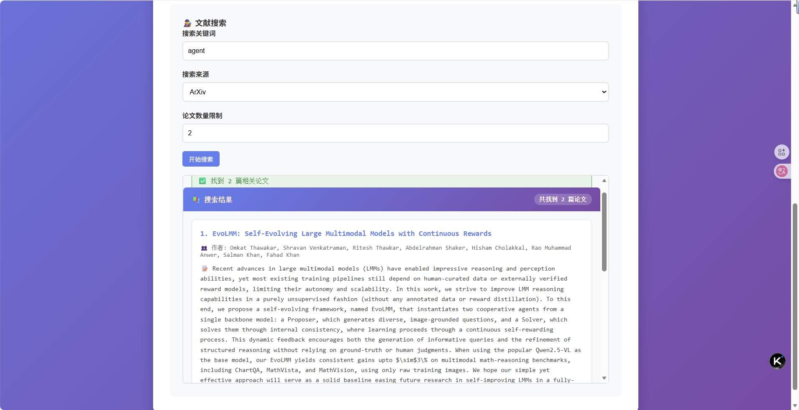
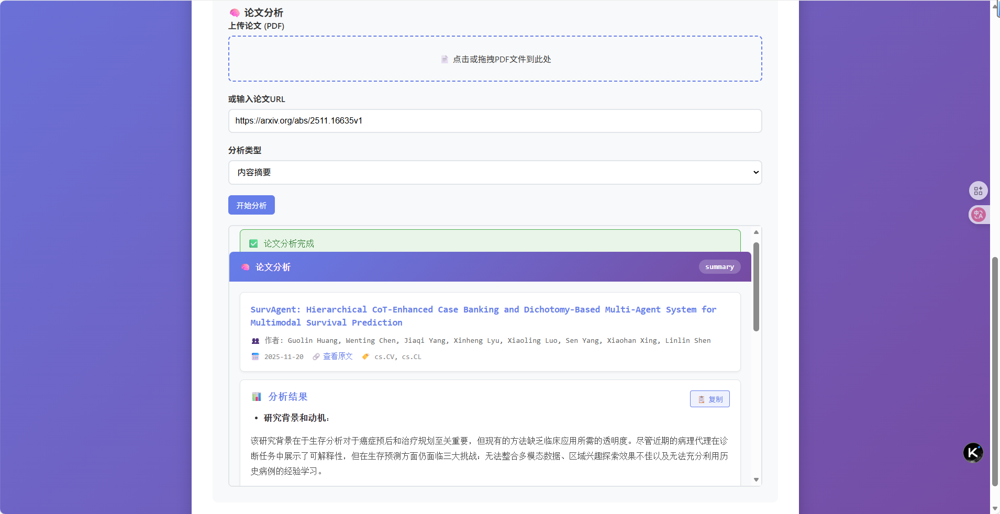

# InnoCore AI - 研创·智核

<div align="center">

**智能科研创新助手 | Intelligent Research Innovation Assistant**

[](https://www.python.org/downloads/)
[](https://fastapi.tiangolo.com/)
[](LICENSE)

*基于多智能体协作的科研全流程自动化系统*

*基于 HelloAgent 框架构建，支持灵活的 LLM 切换*

[English](README_EN.md) | 简体中文

</div>

---

## 📖 项目简介

InnoCore AI（研创·智核）是一个基于 HelloAgent 框架构建的智能科研创新助手系统。通过多智能体协作，实现从论文搜索、深度分析、写作辅助到引用校验的科研全流程自动化。

### 核心特性

- 🤖 **多智能体协作**：四大智能体（Hunter/Miner/Coach/Validator）协同工作
- 🔄 **双模式支持**：单独模式（精细控制）+ 协调模式（一键完成）
- 📚 **智能论文分析**：自动解析 PDF，提取关键信息，生成深度分析报告
- ✍️ **AI 写作助手**：学术润色、风格转换、实时写作建议
- 🔍 **引用智能校验**：自动识别 DOI/ArXiv ID，生成多种格式引用
- 🎯 **工作流自动化**：一键完成搜索→分析→引用→报告全流程

### 技术亮点

- **PDF 深度解析**：支持学术论文的结构化提取（标题、作者、摘要、全文）
- **混合检索**：向量检索 + 关键词匹配，提升检索准确度
- **流式输出**：WebSocket 实时传输，提供流畅的交互体验
- **异步架构**：基于 FastAPI 异步框架，高性能并发处理
- **模块化设计**：清晰的分层架构，易于扩展和维护

## 🎯 应用场景

### 适合谁使用？

- 📖 **研究生/博士生**：快速了解研究领域，辅助论文写作
- 👨‍🏫 **高校教师**：跟踪最新研究进展，辅助课题申报
- 🔬 **企业研发人员**：技术调研，专利分析，竞品研究
- 📝 **学术写作者**：论文润色，引用管理，格式规范

### 典型使用场景

1. **文献综述**：自动搜索相关论文 → 批量分析 → 生成综述报告
2. **论文写作**：实时润色建议 → 引用自动生成 → 格式规范检查
3. **研究调研**：追踪特定主题 → 创新点挖掘 → 研究方向建议
4. **学术翻译**：中英互译 → 学术表达优化 → 术语标准化

## 🏗️ 系统架构

### 整体架构

```
┌─────────────────────────────────────────────────────────┐
│                    前端界面层                            │
│  ┌──────────┐  ┌──────────┐  ┌──────────┐  ┌──────────┐ │
│  │ 论文搜索  │  │ 深度分析  │  │ 写作助手  │  │ 引用管理 │ │
│  └──────────┘  └──────────┘  └──────────┘  └──────────┘ │
└─────────────────────────────────────────────────────────┘
                          ↓
┌─────────────────────────────────────────────────────────┐
│                   API 接口层                             │
│  FastAPI + WebSocket + RESTful API                      │
└─────────────────────────────────────────────────────────┘
                          ↓
┌─────────────────────────────────────────────────────────┐
│                 智能体编排层                             │
│  ┌──────────┐  ┌──────────┐  ┌──────────┐  ┌──────────┐ │
│  │ 🕵️Hunter │  │ 🧠 Miner│  │ ✍️ Coach│  │ 🔎 Validator│ │
│  │ 论文搜索 │  │ 深度分析  │  │ 写作助手  │  │ 引用校验  │ │
│  └──────────┘  └──────────┘  └──────────┘  └──────────┘ │
└─────────────────────────────────────────────────────────┘
                          ↓
┌─────────────────────────────────────────────────────────┐
│                   核心服务层                             │
│  PDF解析 | 向量检索 | LLM调用 | 任务队列                  │
└─────────────────────────────────────────────────────────┘
                          ↓
┌─────────────────────────────────────────────────────────┐
│                   数据持久层                             │
│  PostgreSQL | Qdrant | Redis | 文件存储                  │
└─────────────────────────────────────────────────────────┘
```

### 四大智能体

| 智能体 | 职责 | 核心能力 |
|--------|------|----------|
| 🕵️ **Hunter** | 论文搜索与监控 | ArXiv/IEEE 实时搜索，智能过滤，自动下载 |
| 🧠 **Miner** | 深度分析与挖掘 | PDF 解析，创新点提取，对比分析，报告生成 |
| ✍️ **Coach** | 写作辅助与润色 | 学术润色，风格转换，实时建议，术语优化 |
| 🔎 **Validator** | 引用校验与格式化 | DOI 验证，多格式生成，元数据校验，标准化 |

## Quick Start

### 1. Installation

```bash
# Install core dependencies
python install.py

# Or install manually
pip install fastapi uvicorn python-multipart python-dotenv pydantic httpx requests
```

### 2. Configuration

Create `.env` file:
```bash
cp .env.example .env
# Edit .env file and add your OpenAI API key
```

### 3. Run Application

```bash
python run.py
```

### 4. Access

- Main Application: http://localhost:8000
- API Documentation: http://localhost:8000/docs
- Health Check: http://localhost:8000/health

## Features

### Work Modes

- **Individual Mode**: Use each agent independently for specific tasks
- **Workflow Mode** ⭐: Automated complete workflow coordinating all agents

### Agents

- 🕵️ **Hunter Agent**: Literature search and monitoring
- 🧠 **Miner Agent**: Deep paper analysis and insight extraction
- ✍️ **Coach Agent**: Writing assistance and style improvement
- 🔎 **Validator Agent**: Citation verification and formatting

### Workflow Automation

Complete research workflow in one click:
1. Search papers (Hunter)
2. Analyze content (Miner)
3. Generate citations (Validator)
4. Create report (Coach)

## Project Structure

```
innocore_ai/
├── agents/          # AI agents
├── api/            # REST API routes
├── core/           # Core functionality
├── models/         # Data models
├── services/       # Business logic
├── utils/          # Utilities
├── frontend/       # Web interface
├── main.py         # Main application entry
├── run.py          # Simple run script
├── install.py      # Installation script
└── requirements-core.txt  # Core dependencies
```

## Requirements

- Python 3.8+
- OpenAI API key
- Redis (optional, for caching)

## Development

```bash
# Install development dependencies
pip install -r requirements.txt

# Run with auto-reload
python run.py
```

## 演示效果

### 主界面 - 双模式切换


### 论文搜索功能


### 深度分析功能


## 📊 性能指标

- **论文搜索**：~5秒（ArXiv API 响应时间）
- **PDF 解析**：~3秒/篇（标准学术论文）
- **深度分析**：~20秒/篇（含 AI 推理）
- **写作润色**：~2秒首字生成（流式输出）
- **引用校验**：~3秒/条（含外部 API 验证）
- **完整工作流**：~70秒（搜索3篇+分析+引用+报告）

## 🛣️ 开发路线图

### v1.0（当前版本）✅
- [x] 四大智能体基础功能
- [x] PDF 深度解析
- [x] 双模式工作流
- [x] Web 界面
- [x] API 文档

### v1.1（计划中）
- [ ] 向量数据库集成（Qdrant）
- [ ] 用户系统与权限管理
- [ ] 历史记录与收藏功能
- [ ] 批量处理优化

### v2.0（未来）
- [ ] 双层知识库（L1预置+L2私有）
- [ ] 个性化写作风格学习
- [ ] 多语言支持
- [ ] 移动端适配

## 🤝 贡献指南

欢迎贡献代码、报告问题或提出建议！

1. Fork 本仓库
2. 创建特性分支 (`git checkout -b feature/AmazingFeature`)
3. 提交更改 (`git commit -m 'Add some AmazingFeature'`)
4. 推送到分支 (`git push origin feature/AmazingFeature`)
5. 开启 Pull Request

## 📄 许可证

本项目采用 MIT 许可证 - 详见 [LICENSE](LICENSE) 文件

## 🙏 致谢

- [HelloAgent](https://github.com/datawhalechina/hello-agents) - 多智能体框架
- [FastAPI](https://fastapi.tiangolo.com/) - 现代 Web 框架
- [ArXiv API](https://arxiv.org/help/api) - 学术论文数用开发框架
- [ArXiv API](https://arxiv.org/help/api) - 学术论文数据源

## 📮 联系方式

- 项目主页：[GitHub](https://github.com/A-pricity/innocore-ai)
- 问题反馈：[Issues](https://github.com/A-pricity/innocore-ai/issues)
- 邮箱：2827867731@qq.com

---

<div align="center">

**如果这个项目对你有帮助，请给一个 ⭐️ Star！**

Made with ❤️ by InnoCore AI Team

</div>