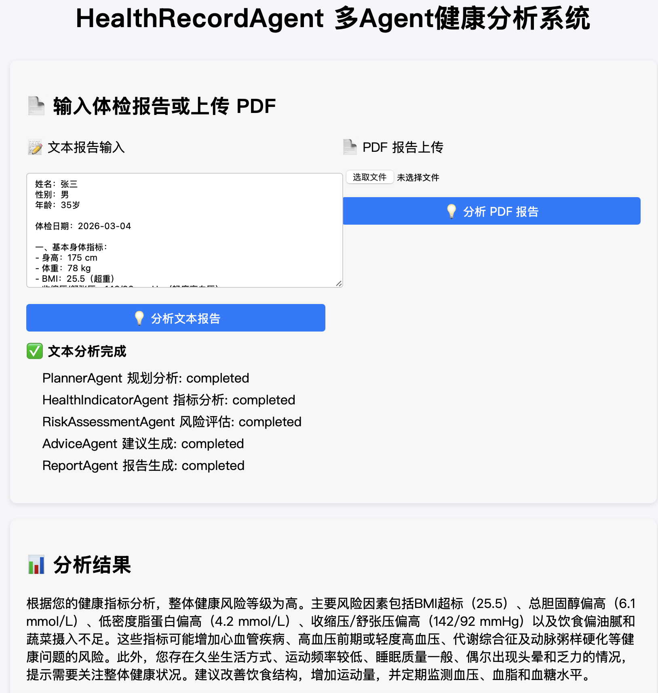

# 健康档案助手-HealthRecordAgent

> 基于 HelloAgents 框架的多智能体健康档案助手
> 支持体检报告、健康档案（文本、PDF）结构化解析、指标解读和健康建议生成

## 📝 项目简介

在现实场景中，体检报告通常以 PDF 或表格形式给出，包含大量医学指标，但：
- 指标含义不清晰
- 正常 / 异常范围难以判断
- 缺乏整体健康解读和可执行建议

本项目通过 **多智能体协作（Multi-Agent）** 的方式，对体检报告进行：
- 结构化解析
- 指标语义解释
- 风险初步评估
- 个性化健康建议生成

适用于：
- 个人健康管理
- 健康数据理解与科普
- 多智能体应用 / Agent 系统毕业设计示例

## ✨ 核心功能

- [x] **体检报告解析**
  - 支持 PDF / 文本形式的体检报告输入
  - 自动抽取关键健康指标（如血常规、生化指标等）
- [x] **健康指标解读**
  - 给出指标含义、参考范围与异常提示
  - 使用自然语言进行“非医学术语”的解释
- [x] **多智能体协作分析**
  - 不同 Agent 分工完成解析、判断与建议生成
  - 提高分析的结构性与可解释性
- [ ] **健康档案长期管理（规划中）**
  - 多次体检记录对比
  - 趋势分析与健康变化追踪

## 🛠️ 技术栈

- HelloAgents框架
- 使用的智能体范式（如ReAct、Plan-and-Solve等）
    Plan-and-Solve + ReAct（混合）
    由一个 Planner 规划健康分析流程，多个 Specialist Agent 按步骤协作完成健康档案解读   
- **后端框架**: FastAPI + Uvicorn
- **异步处理**: asyncio
- **PDF 解析**: pdfplumber

智能体协作方式：
- PlannerAgent 负责整体分析流程规划  
- HealthIndicatorAgent 解析指标并解读  
- RiskAssessmentAgent 进行风险评估  
- AdviceAgent 生成个性化健康建议  
- ReportAgent 汇总输出最终报告 

## 🚀 快速开始

### 环境要求

- Python 3.10+
- 其他要求

### 安装依赖

pip install -r requirements.txt

### 配置API密钥

# 创建.env文件
cp .env.example .env

# 编辑.env文件，填入你的API密钥

### 运行项目

uvicorn backend.api.routes.main:app --reload

服务启动后，可通过浏览器或前端调用 API 接口：
	•	文本报告分析: POST /api/health/analysis
	•	PDF 报告分析: POST /api/health/analysis/pdf
	•	任务状态查询: GET /api/health/task_status/{task_id}

## 🎯 项目亮点
	•	多智能体分工协作，结构化解析体检报告
	•	支持文本与 PDF 输入，自动抽取健康指标
	•	可扩展健康档案管理与趋势分析
	•	异步任务处理，前端实时显示 Agent 执行状态

## 📖 使用示例

## 🤝 贡献指南

欢迎提出Issue和Pull Request！

## 👤 作者

- GitHub: [@Shawnxyxy](https://github.com/Shawnxyxy)
- Email: 852679909@qq.com

## 🙏 致谢

感谢Datawhale社区和Hello-Agents项目！