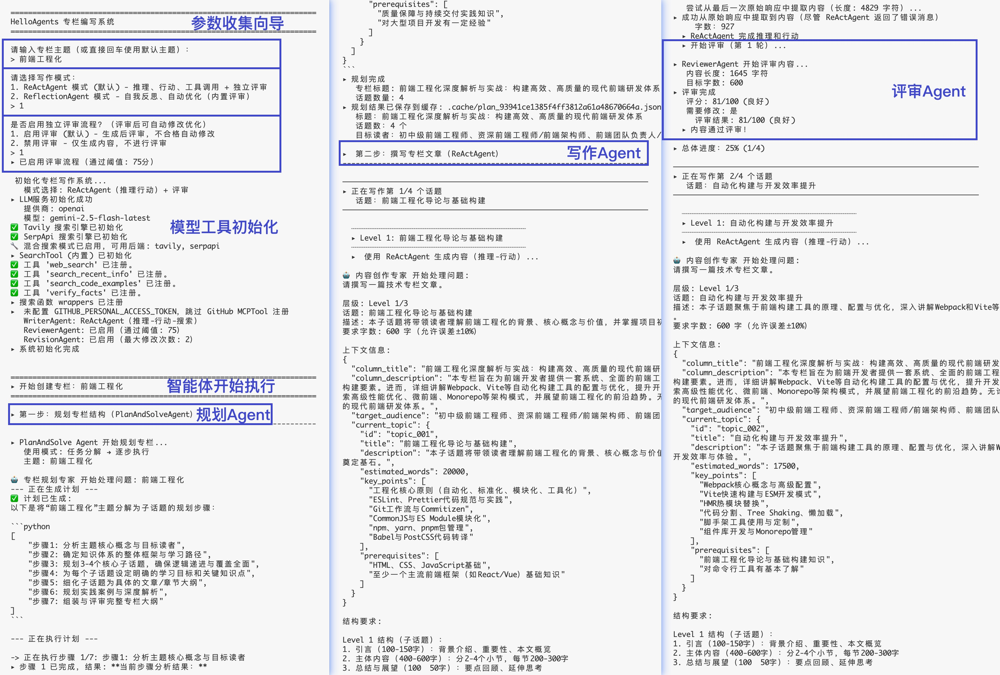
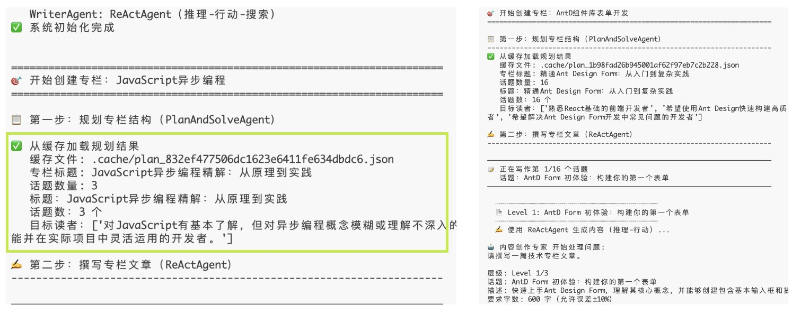
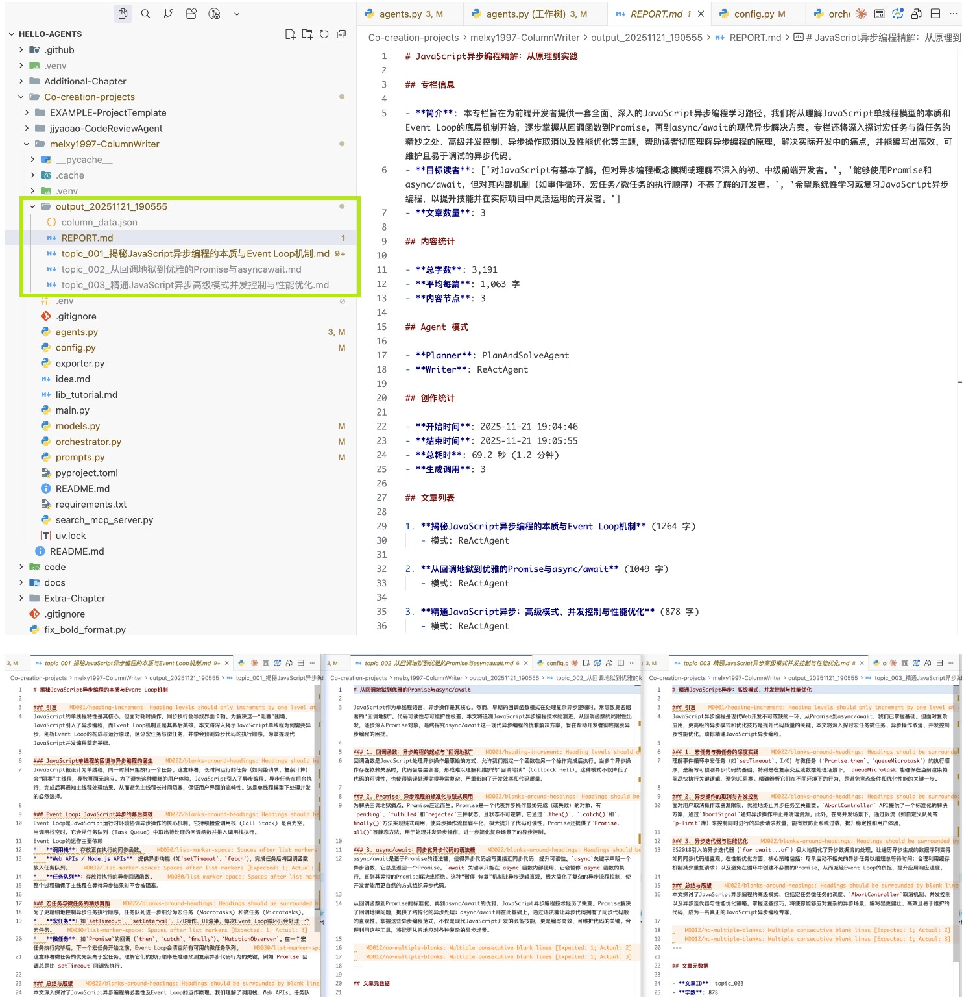

# 专栏作家智能体 (Column Writer Agent)

一个基于 [HelloAgents](https://github.com/helloagents/hello-agents) 框架构建的智能专栏写作系统，采用多智能体/多设计模式，自动完成专栏的规划、撰写、评审和优化。


## ▸ 项目简介

这个智能体模拟了一个专业的创作者团队，包括：
- **策划专家**：负责顶层设计和内容规划
- **写作专家**：负责具体内容的撰写和工具调用
- **评审专家**：负责内容质量把控和反馈

支持树形递归生成专栏目录，可以创作出结构严谨、内容详实的长篇技术专栏。

## ▸ 核心功能

1.  **智能规划与分解**：
    *   利用 Plan-and-Solve 模式，自动将一个宽泛的主题（如"Python异步编程"）拆解为包含多个子话题和章节的完整大纲。
    *   支持多层级递归展开，生成深度内容。

2.  **多模式智能写作**：
    *   **ReAct 模式**：结合推理与行动，写作过程中主动调用搜索工具获取最新信息。
    *   **Reflection 模式**：通过自我反思（Self-Reflection）机制，生成初稿后自动评审并优化。

3.  **联网搜索增强**：
    *   集成 Tavily/SerpApi，确保内容的时效性和准确性。
    *   集成 GitHub MCP，可直接读取开源项目代码作为案例。

4.  **质量闭环控制**：
    *   内置评分系统，对生成内容进行多维度评审（准确性、逻辑性、易读性）。
    *   分数不足自动触发修改流程，直至达到质量标准。

5.  **智能缓存与容错**：
    *   支持规划结果缓存，避免重复生成。
    *   具备强大的错误恢复机制，在 Agent 调用失败时自动降级处理，确保任务完成。

## ▸ 技术栈

*   **核心框架**: [HelloAgents](https://github.com/helloagents/hello-agents)
*   **Agent Patterns**: Plan-and-Solve, ReAct, Reflection
*   **Tools**:
    *   MCP (Model Context Protocol)
    *   Tavily / SerpApi (Search)
    *   GitHub API
*   **Runtime**: Python 3.10+

## ▸️ 模块架构

系统由以下核心模块组成：

| 模块 | 文件 | 说明 |
|------|------|------|
| **Orchestrator** | `orchestrator.py` | **主控中心**。负责协调各个 Agent 的工作流程，管理状态流转，组合最终结果。 |
| **Agents** | `agents.py` | **智能体实现**。包含 `PlannerAgent` (规划)、`WriterAgent` (写作)、`ReviewerAgent` (评审)、`RevisionAgent` (修改)、`ReflectionWriterAgent` (反思写作) 等核心类。 |
| **Models** | `models.py` | **数据建模**。定义了 `ContentNode` (内容树)、`ColumnPlan` (规划)、`ReviewResult` (评审结果) 等数据结构。 |
| **Tools** | `agents.py` | **工具**。集成了 `SearchTool` (Tavily/SerpApi) 和 `MCPTool` (GitHub)，赋予 Agent 联网和代码库访问能力。 |
| **Prompts** | `prompts.py` | **提示词**。包含规划、写作、评审、修改等各个环节的 Prompt Template。 |
| **Config** | `config.py` | **配置管理**。处理环境变量、模型参数、评审阈值等。 |
| **Utils** | `utils.py` | **工具函数**。包含 `JSONExtractor` (JSON 提取)、`parse_react_output` (ReAct 输出解析) 等公共工具。 |

## ▸ 基本流程 (Workflow)

系统工作流是一个多阶段、递归的过程：

1.  **规划阶段 (Planning)**
    *   用户输入专栏主题。
    *   **Planner Agent** (`PlanAndSolveAgent`) 分析主题，分解任务，生成结构化的 `ColumnPlan` (包含标题、简介、目标读者、子话题列表)。

2.  **写作阶段 (Writing - Recursive)**
    *   Orchestrator 遍历规划中的每个子话题，启动写作任务。
    *   **Writer Agent** (`ReActAgent` 或 `ReflectionAgent`) 负责生成内容。
    *   **递归展开**：
        *   **Level 1 (Topic)**: 生成子话题引言和概述。
        *   **Level 2 (Section)**: 细化为小节，进行深入阐述。
        *   **Level 3 (Detail)**: 补充具体案例、代码或详细说明。
    *   Agent 会根据配置的 `MAX_DEPTH` 自动判断是否继续展开。

3.  **工具调用 (Tool Use)**
    *   在写作过程中，Writer Agent 可以主动调用工具：
        *   `web_search`: 搜索最新技术动态、统计数据。
        *   `search_code_examples`: 查找代码示例。
        *   `verify_facts`: 验证事实准确性。
        *   `github`: (可选) 搜索 GitHub 仓库，读取真实项目代码。

4.  **评审与优化 (Review & Refine)**
    *   **ReAct 模式 + 独立评审**: 内容生成后，`ReviewerAgent` 进行多维度评分（内容质量、结构逻辑、语言表达、格式规范）。如果分数低于阈值（默认75分），`RevisionAgent` 根据评审意见进行修改，循环直到通过或达到最大修改次数。
    *   **Reflection 模式**: 使用 `ReflectionAgent`，Agent 生成初稿后立即自我反思 (Self-Reflection) 并自动优化，一步到位。

5.  **组装与导出 (Assembly & Export)**
    *   将生成的递归内容树 (Content Tree) 展平。
    *   生成 Markdown 格式的完整文章。
    *   输出统计报告 (`REPORT.md`)，包含字数、耗时、质量评分等数据。

## ▸ 智能体模式 (Agent Patterns)

本项目应用了多种 Agent 设计模式：

### 1. Plan-and-Solve (规划与求解)
*   **应用**: `PlannerAgent`
*   **原理**: 将复杂任务分解为步骤列表 (Plan)，然后逐个执行 (Solve)。
*   **优势**: 适合处理宏观的、需要长链条推理的规划任务，避免一步生成导致的逻辑混乱。

### 2. ReAct (推理+行动)
*   **应用**: `WriterAgent`
*   **原理**: 循环执行 **Reasoning (思考)** -> **Acting (行动/工具调用)** -> **Observation (观察结果)**。
*   **优势**: 使 Agent 能够与外部世界交互 (搜索、查库)，不仅仅依靠训练数据写作，确保内容的实效性和准确性。

### 3. Reflection (反思)
*   **应用**: `ReflectionWriterAgent`
*   **原理**: 生成内容 -> 自我评估 (Critic) -> 优化内容 (Refine)。
*   **优势**: 显著提升内容质量，模拟人类"写完读一遍再改"的创作习惯。

### 4. Independent Review (独立评审)
*   **应用**: `ReviewerAgent` + `RevisionAgent`
*   **原理**: 
    - `ReviewerAgent`: 对生成的内容进行多维度评审（内容质量40分、结构逻辑30分、语言表达20分、格式规范10分），输出详细的评分和修改建议。
    - `RevisionAgent`: 根据评审意见进行针对性修改，保留优点、修复问题。
*   **优势**: 专业分工，评审标准统一，可追溯评审历史，支持多轮修改直到达标。

## ▸️ 模型与工具 (Models & Tools)

### 模型支持
通过 `config.py` 配置，支持多种 LLM 后端：
- **其他兼容模型**: 任何支持 OpenAI 接口格式的模型

### 模型工具
1.  **SearchTool (联网搜索)**
    *   支持后端: Tavily (推荐), SerpApi, DuckDuckGo 等。
    *   功能: 提供实时信息检索，解决大模型幻觉和知识滞后问题。
2.  **MCPTool (Model Context Protocol)**
    *   支持 GitHub MCP Server。
    *   功能: 允许 Agent 直接搜索 GitHub 仓库、查看文件内容、分析代码结构，适合编写技术类专栏。

## ▸ 优化特性 (Features)

### 1. 智能缓存机制 (Smart Caching)
*   **Planner 缓存**: `CachedExecutor` 会缓存规划阶段的每个步骤结果。如果主题相同，再次运行时会直接加载缓存，节省 Token 和时间。
*   **文件缓存**: 规划结果 (`ColumnPlan`) 会持久化到本地 `.cache` 目录。



### 2. 模型输出解析 (Robust Parser)
*   实现了增强版的 JSON 解析器，能够处理 LLM 输出的各种非标准 JSON 格式（如包含 Markdown 代码块、注释、不完整的括号等）。
*   支持从历史对话 (`history`) 中回溯提取有效信息，防止因某次输出格式错误导致整个任务失败。

### 3. 错误恢复 (Error Recovery)
*   当 `ReActAgent` 达到最大步数或执行失败时，会自动回退到 `SimpleAgent`，利用已有的历史信息 (`history_summary`) 尝试直接生成结果，确保流程不直接终止。


## ▸ 快速开始

### 1. 安装依赖
```bash
pip install -r requirements.txt
```

### 2. 配置环境变量
复制 `env.example` 到 `.env` 并填写配置：
```env
# LLM 配置
OPENAI_API_KEY=your_key
OPENAI_BASE_URL=...

# 搜索配置 (可选，但推荐)
TAVILY_API_KEY=tvly-... 
# 或
SERPAPI_API_KEY=...

# GitHub MCP (可选)
GITHUB_PERSONAL_ACCESS_TOKEN=...
```

### 3. 运行
```bash
# 交互式模式
python main.py

# 命令行模式
python main.py "Python 异步编程"
```

### 4. 查看结果
运行完成后，结果将保存在 `output_YYYYMMDD_HHMMSS` 目录下。



## ▸ 作者信息
```
- Name: Xinyu Liu
- Work: Trip.com
- Role: Web Developer
- Github: melxy1997
- EMail: melxy#foxmail.com
```