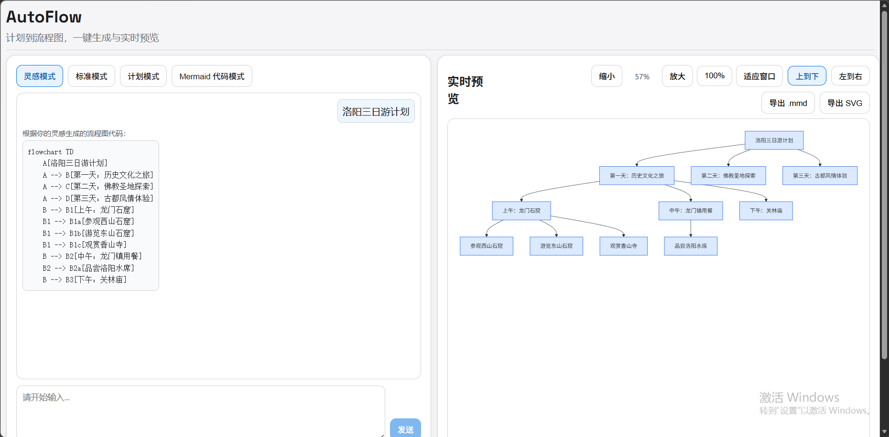
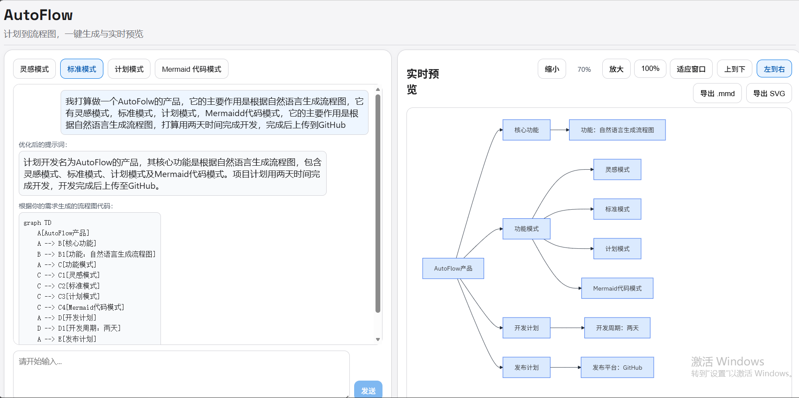

# 智能流程图生成工具(AutoFlow)

> 智能流程图生成工具：从自然语言到 Mermaid，一键生成并实时预览。

## 📝 项目简介

AutoFlow 是一个前后端分离的流程图生成项目，目标是把用户的想法、需求或计划文本，快速转换为可渲染的 Mermaid 流程图。

它主要解决三个问题：

- 文本到流程图转换效率低
- 手写 Mermaid 成本高、容易出错
- 流程表达缺少统一结构和可视化反馈

适用场景：

- 需求梳理与方案沟通
- 产品/运营流程设计
- 教学与知识结构化表达
- 项目任务流可视化

## ✨ 核心功能

- 灵感模式：输入想法，自动补全并生成流程图
- 标准模式：先优化提示词，再生成 Mermaid 代码
- 计划模式：按行输入步骤，生成线性流程图
- Mermaid 代码模式：直接输入代码并实时渲染
- 方向切换与预览操作：支持上到下/左到右、缩放、拖拽、导出

## 🛠️ 技术栈

- 智能体框架：HelloAgents
- 后端：FastAPI + SSE 流式返回
- 前端：React + Vite + Mermaid
- 核心能力：提示词优化、结构化生成、语法校验与修复

## 📁 项目结构

```
usernamedadad-AutoFlow/
├── backend/                    # 后端代码
│   ├── app/
│   │   ├── agents/             # 智能体模块
│   │   │   └── mermaid/        # Mermaid 生成智能体
│   │   ├── models/             # 数据模型
│   │   ├── prompts/            # 提示词模板
│   │   ├── routers/            # API 路由
│   │   ├── services/           # 业务服务
│   │   └── tools/              # 工具函数
│   ├── .env.example            # 环境变量示例
│   └── requirements.txt        # Python 依赖
├── frontend/                   # 前端代码
│   ├── src/
│   │   ├── services/           # API 服务
│   │   ├── styles/             # 样式文件
│   │   ├── App.jsx             # 主组件
│   │   └── main.jsx            # 入口文件
│   ├── index.html
│   ├── package.json
│   └── vite.config.js
├── data/                       # 数据资源
│   └── images/                 # 示例图片
├── README.md
└── .gitignore
```

## 🚀 快速开始

### 环境要求

- Python 3.10+
- Node.js 18+
- npm 9+

### 安装依赖

后端（进入后端对应目录）：

```bash
pip install -r requirements.txt
```

前端（进入前端对应目录）：

```bash
npm install
```

### 配置 API 密钥

在 backend 目录创建 .env（可参考 .env.example），至少配置：

- LLM\_MODEL\_ID
- LLM\_API\_KEY
- LLM\_BASE\_URL
- LLM\_TIMEOUT

### 运行项目

1. 启动后端（进入后端对应目录）

```bash
uvicorn app.main:app --reload --host 0.0.0.0 --port 8000
```

1. 启动前端（进入前端对应目录）

```bash
npm run dev
```

1. 浏览器打开前端地址（默认）

- <http://localhost:5173>


## 📖 使用示例

### 灵感模式示例

输入示例：

```text
洛阳三日游计划
```

效果示例：



### 创造（标准）模式示例

输入示例：

```text
我打算做一个AutoFlow产品，它的主要作用是根据自然语言生成流程图，它有灵感模式、标准模式、计划模式，Mermaid代码模式，它的主要作用是根据自然语言生成流程图，打算用两天时间完成开，完成后上传到GitHub。
```

效果示例：



通用操作：

1. 点击发送，等待流式生成
2. 在右侧预览区切换方向（上到下/左到右）
3. 按需缩放并导出 .mmd / SVG

## 🎯 项目亮点

- 采用 HelloAgents 构建智能体流程，具备可扩展性
- 生成链路包含“优化 -> 生成 -> 校验”闭环
- 前后端解耦，交互体验流畅，支持实时状态反馈

## 🔮 未来计划

- 增加更细粒度的生成风格控制
- 引入流程图模板库与行业预设
- 优化超时场景下的降级策略与重试机制

## 🤝 贡献指南

欢迎提交 Issue 和 Pull Request。

建议流程：

- 新建分支
- 提交改动与说明
- 发起 PR 并描述测试结果

## 📄 许可证

MIT License

## 🙏 致谢

感谢 Datawhale 社区与 HelloAgents 项目。
