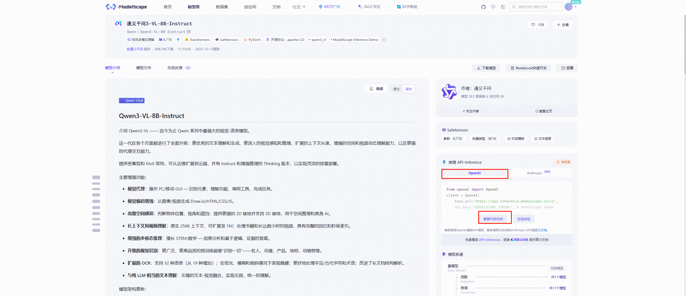
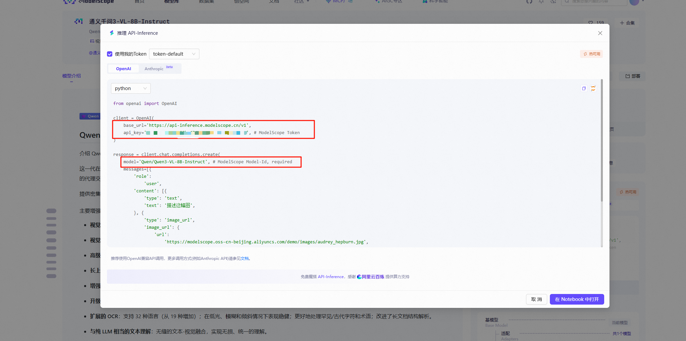

# Hello-Agents Datawhale常见问题 FAQ

> 本文基于 2024-12-01 直播间 QA 整理，以及首期课程建设答疑收集，用作 \
> Datawhale《Hello-Agents 零基础入门》课程的扩展阅读。\
> 建议配合主课程文档一起学习：
> - 🔗 [课程文档](https://datawhalechina.github.io/hello-agents/#/)
> - ⌛️ 课程视频(待上线)

---

## 1. 多智能体架构与并行调度

<strong>Q1. 多智能体系统如何实现“多线程并行”？任务规划 Agent 拆出的可并行步骤，怎样让多个执行 Agent 自己认领任务并自动处理依赖？有没有现成框架？</strong>

- 要点整理：
  - 先由「任务规划 Agent」做任务依赖拆分，形成可并行和有依赖的子任务。
  - 执行层可以设计为多个专职 Agent，每个只处理自己负责的子任务。
  - 并行调度通常通过队列 / API 轮询等方式实现，多数场景需要结合业务做定制，没有完全通用的一键解决方案。
- 课程指引：多智能体范式与系统架构相关章节（经典范式 + 框架实战部分）。

---

## 2. 框架生态与通信协议

### 2.1 主流框架与 Hello-Agents 的定位

<strong>Q2. 目前主流 Agents 框架有哪些？Hello-Agents 主要解决什么问题？</strong>

- 要点整理：
  - 主流框架的系统对比与更新节奏在课程第六章集中讨论，这里不重复列举。
  - <strong>Hello-Agents 的定位</strong>：以教学与学习为主，强调“结构清晰 + 可落地 + 便于举一反三”，帮助初学者建立完整的 Agent 知识与实践框架。
- 课程指引：第六章「框架开发实践」。

<strong>Q7. Hello-Agents 看起来功能很全，如果想用于生产，大概还需要补哪些能力？</strong>

- 要点整理：
  - 框架本身偏“教学 +可用”，真正生产落地还需要结合业务做二次开发。
  - 核心增强点通常在：
    - 业务知识建模与场景理解；
    - 更稳健的日志、监控、评估与回滚机制；
    - 性能优化与成本控制。
- 课程指引：框架部分 + 项目实战章节。

### 2.2 Hello-Agents 与 LangGraph / 其他框架的联动

<strong>Q4. Hello-Agents 如何和 LangGraph 联合使用？是谁调用谁？</strong>

<strong>Q11 / Q15. 想知道如何用 A2A 让 Hello-Agents 和 LangGraph 联合起来？</strong>

- 要点整理（合并回答）：
  - 可以用 <strong>A2A 协议 + Agent Card</strong>，把「一个框架里的 Agent」暴露成另一个框架可调用的“远程能力”。
  - 类比 Function Calling：LangGraph 的节点可以把 Hello-Agents 中的 Agent 当作“远程函数”来调用，反之亦可以。
- 课程指引：第十章「智能体通信协议」。第六章「框架开发实践」。

<strong>Q17. 学习过程中会介绍 DeepResearch 和其他开源 / 现成框架吗？</strong>

- 要点整理：
  - DeepResearch属于Workflow内容，将在后续补充。
  - 框架之类相关内容集中在 <strong>第五章、第六章</strong>，从“单框架”到“多框架生态”都会涉及。
- 课程指引：第五章、 第六章（框架与应用案例）。

<strong>Q18. 用 LangGraph 写 Agent 时感觉更像“大模型工作流脚本”，真正落地成项目需要考虑什么？课程里有吗？</strong>

- 要点整理：
  - 从“脚本”到“项目”要多考虑：模块边界、配置管理、监控和评估、错误恢复、以及团队协作等工程问题。
  - 课程 <strong>第四部分</strong> 专门带大家从零构建一个完整项目，可以对照实践。
- 课程指引：第四部分「构建项目」。

### 2.3 通信协议：A2A & ANP

<strong>Q5. A2A 和 ANP 讲得太快了，能不能更详细一些，并配上代码示例？</strong>

- 要点整理：
  - 课程中会从「动机 → 抽象 → 协议字段 → 代码示例」逐步展开。
  - 推荐补充阅读 Datawhale《动手学 Agent 应用开发》中「智能体通信协议」一章（ANP 社区作者的讲解）。
- 课程指引：第十章；可在 README 的“扩展阅读”中链接到 Datawhale 官方文档。

<strong>Q6. 实战时是更推荐本地部署，还是直接用 API？</strong>

- 要点整理：
  - 课程 <strong>第七章</strong> 同时给出两种路线：本地部署和云端 API。
  - 学习阶段：优先 API（门槛低），需要控制成本或离线部署时再考虑本地。
  - 课程指引：第十章

相关的内容课程指引：
- 🔗 第五章 「基于低代码平台的智能体搭建」。点击跳转：[第五章](https://github.com/datawhalechina/hello-agents/blob/main/docs/chapter5/第五章%20基于低代码平台的智能体搭建.md)
- 🔗 第六章「框架开发实践」。点击跳转：[第六章](https://github.com/datawhalechina/hello-agents/blob/main/docs/chapter6/第六章%20框架开发实践.md)
- 🔗 第七章「构建你的智能体框架」。点击跳转：[第七章](https://github.com/datawhalechina/hello-agents/blob/main/docs/chapter7/第七章%20构建你的Agent框架.md)
- 🔗 第十章「智能体通信协议」。点击跳转：[第十章](https://github.com/datawhalechina/hello-agents/blob/main/docs/chapter10/第十章%20智能体通信协议.md)


---

## 3. 课程定位、学习路径与适合人群

<strong>Q9. 后续课程会放在哪些平台？</strong>

- 要点整理：
  - Github 仓库（课程代码与文档）  
  - Datawhale B 站（视频）  
  - Datawhale 官网（图文课程入口）  

<strong>Q10. 完全零基础适合学吗？</strong>

- 要点整理：
  - 可以学，但需要「慢一点 + 多看代码拆解」。
  - 没有 Python 基础的同学需要额外花精力补语法，课程本身并非完全“零编程”的难度。
  - Python推荐Datawhale独家课程：🔗 [聪明办法学Python](https://datawhalechina.github.io/learn-python-the-smart-way-v2/)
  - 本课程在有Python基础课程上建议学习路径如下：
    1. 环境配置、前言
    2. 🔗 [第一章 初识智能体](https://github.com/datawhalechina/hello-agents/blob/main/docs/chapter1/第一章%20初识智能体.md)
    3. 🔗 [第二章 智能体发展史](https://github.com/datawhalechina/hello-agents/blob/main/docs/chapter2/第二章%20智能体发展史.md)
    4. 🔗 [第三章 大语言模型基础](https://github.com/datawhalechina/hello-agents/blob/main/docs/chapter3/第三章%20大语言模型基础.md)
    5. 🔗 [第四章 智能体经典范式构建](https://github.com/datawhalechina/hello-agents/blob/main/docs/chapter4/第四章%20智能体经典范式构建.md)
    6. 🔗 [第五章 基于低代码平台的智能体搭建](https://github.com/datawhalechina/hello-agents/blob/main/docs/chapter5/第五章%20基于低代码平台的智能体搭建.md)
    7. 🔗 [第六章 框架应用开发实践](https://github.com/datawhalechina/hello-agents/blob/main/docs/chapter6/第六章%20框架开发实践.md)

<strong>Q12. 课程 1.1 和 2.1 看起来有点像，它们各自的侧重点是什么？</strong>

- 要点整理：
  - <strong>2.1</strong>：按发展时间线系统梳理 Agent，并扩展到专家系统等案例，更偏“历史脉络 + 全景视角”。  
  - <strong>1.1</strong>：作为开篇导入，简单介绍基本概念与背景。

<strong>Q13. 已经在工作中的同学怎么学？学完之后在工作中怎么用？和 n8n 这类工作流工具有什么区别？</strong>

- 要点整理：
  - 学习建议：结合自己业务场景，优先做一个“小而完整”的 Agent 应用，哪怕只是替代一小段工作流程。
  - 与工作流（n8n 等）的核心差异：
    - 工作流：流程和分支基本固定，用来解决“结构比较确定”的任务。
    - Agent：适合更复杂、更不确定的任务，可以在运行中做一定程度的自主决策（调用工具、规划子任务等）。
- 课程指引：概念章节 + 经典范式与项目实战部分。

<strong>Q14. 课程里有哪些章节是专门讲 Agent 测试与评估的？</strong>

- 要点整理：
  - 有单独的评估章节（如第十二章），也会在其他章节中形成“闭环测评”的实践案例。
- 课程指引：测试与评估专章 + 相关项目实践。
- 🔗 [第十二章](https://github.com/datawhalechina/hello-agents/blob/main/docs/chapter12/第十二章%20智能体性能评估.md)

<strong>Q16. 做课程里的实验，最低硬件配置是什么？需要显卡吗？</strong>

- 要点整理：
  - <strong>Agentic RL 章节</strong>：建议显存 ≥ 4G 的 GPU 环境体验会更好。
  - 其他章节使用 API 即可完成全程学习，不强制要求本地 GPU。
- 课程指引：Agentic RL 相关章节说明。

<strong>Q20. 在读学生适合学习这门课吗？</strong>

- 要点整理：
  - 非常适合，把它当作“AI + 软件工程”交叉方向的入门项目。
  - 建议和自己的毕业设计 / 科研小项目结合起来，提升实践价值。
  - 毕业设计成果可通过提交pr形式提交到本项目中：
    - 🔗 [Co-creation-projects](https://github.com/datawhalechina/hello-agents/tree/main/Co-creation-projects)。

---

## 4. 知识与工具：RAG / KAG / 知识图谱 / RL 等

<strong>Q3. 搭 Agent 一定要用到 RAG 吗？</strong>

- 要点整理：
  - RAG 不是 Agent 的必选项，而是一类常见的“外部知识工具”。
  - 课程 <strong>第八章</strong> 会从零实现一个 RAG 方案，帮助理解“有 RAG / 无 RAG”在系统设计上的差异。
- 课程指引：第八章。
- 🔗 [第八章 记忆与检索](https://github.com/datawhalechina/hello-agents/blob/main/docs/chapter8/第八章%20记忆与检索.md)

<strong>Q21. KAG / 知识图谱和 Agent 有什么关系？</strong>

- 要点整理：
  - 可以把 KAG / 知识图谱理解为 Agent 的一种“工具”或“知识底座”：
    - Agent 负责决策与调用；
    - 知识图谱提供结构化知识与检索能力。

<strong>Q22. RL、LLM、RLHF 按照第 1 章“学习型 Agent 与 LLMs-based Agent”的分类标准，分别属于什么？</strong>

- 要点整理：
  - RL、LLM、RLHF 都更像是 Agent 的<strong>组成部分或实现技术</strong>，而不是一个单独的“Agent 类型”。
  - 例如：LLM 可以作为 Agent 的大脑；RL / RLHF 可以用于训练或微调 Agent 的策略。

---

## 5. 性能与上下文管理

<strong>Q19. 复杂任务的系统提示词很长，每次调用 token 很多，导致响应变慢；上下文越长这个问题越严重，该如何平衡？</strong>

- 要点整理：
  - 关键在于「上下文裁剪与管理」：对话历史、工具调用结果、系统提示等要分层、分级保留。
  - 可以通过“摘要 + 记忆模块 + 检索式上下文”来减轻 token 压力。
  - 课程 <strong>第九章</strong> 专门讲上下文处理策略。
- 课程指引：第九章。
- 🔗 [第九章 上下文工程](https://github.com/datawhalechina/hello-agents/blob/main/docs/chapter9/第九章%20上下文工程.md)

---

## 6. 项目与职业发展

<strong>Q8. 课程里的几个案例项目可以写进简历吗？</strong>

- 要点整理：
  - 可以，前提是你真正理解并能解释清楚：
    - 项目解决了什么问题；
    - 用了哪些 Agent 设计；
    - 在工具调用 / 评估 / 部署上做了哪些具体工作。
  - 建议在简历上用“问题-方案-结果”的结构来描述这些项目，并附上 Github 链接。

---

## 7. 环境配置与模型使用、API调用相关问题

<strong>Q17. 课程中的API是如何设置的，存在调用失败情况</strong>

- 要点整理：
  - 课程项目模型API支持：
    - [硅基流动Inference API](https://modelscope.cn/models)；
    - [Deepseek API](https://platform.deepseek.com/usage);
    - [OpenAI API](https://platform.openai.com/docs/quickstart);
    - 其他 ...
  - 配置流程，获取API_KEY、MODEL_ID、BASE_URL设置于环境变量`.env`文件中。
  - modelscope社区的模型api获取方法 https://www.modelscope.cn/models/Qwen/Qwen3-VL-8B-Instruct
    - 点击模型库，找到支持API-Inference的模型，点击进入模型详情页面，找到API-Inference
    - 
    - 


<strong>Q18. 在实现ReAct工作流的时候，这个serpApi网页搜索工具还有没有替代的？</strong>

- 要点整理：
  - 需要科学上网，无法科学上网更换方案；
  - 可以考虑其他搜索引擎，如：duckduckgo,geoglesearch等。

<strong>Q21. 使用的推理模型只支持流式输出，不能进入智能体的后续循环</strong>

- 要点整理：
  - DeepSeek、Qwen等推理模型默认只提供流式API，需要自行进行正确的拼接而不是 简单的字符串拼接（具体如何拼接可参考第七章）

<strong>Q23. 将记忆跟知识库关联起来，不知道该怎么理解。</strong>

- 要点整理：
  - 我理解的是：打个比方，通常agent有短期记忆和长期记忆，短期记忆就相当于我们一天中干的事情我们可以通过上下文的方式直接作为input输入给模型。但是长期记忆就相当于我们记笔记，我们不能在上下文一下输入这么多信息，所以我们就让做一个工具供给模型调用，模型可以生成一个query 然后通过RAG的方式在我们的知识库当中去调用 也就是长期记忆。

<strong>Q24. 清华源镜像请求错误，403</strong>

- 要点整理：
  - 网络原因，更换中科大：
    - https://mirrors.ustc.edu.cn/anaconda/pkgs/main/
    - https://mirrors.ustc.edu.cn/anaconda/pkgs/free/

<strong>Q25. 模型API调用401错误</strong>

- 要点整理：
  - 模型余额不足，需要充值。

**Q27. Hugging Face 开源大模型报错Connection aborted.**

- 要点整理：
  - 网络原因，建议使用HF_ENDPOINT进行配置
    - 示例详见 code/chapter3/Qwen.py
    - https://hf-mirror.com
   
如果报错(MaxRetryError("HTTPSConnectionPool(host='huggingface.co', port=443)这个错误
可以在代码中加入
```
import os
os.environ["HF_ENDPOINT"] = "https://hf-mirror.com"
```
或者直接在命令行
(Linux\mac)
```bash
export HF_ENDPOINT="https://hf-mirror.com"
```
(win's powshell)
```bash
$env:HF_ENDPOINT = "https://hf-mirror.com"
```


## 8. 数学基础问题

<strong>Q22. 在概率公式中，如何理解P(w_2∣w_1)</strong>

- 要点整理：
  - 概率学中的条件概率，即w_1发生的情况下，w_2发生的概率

## 9. 其他问题

### 9.1 毕业设计相关

<strong>Q26. 提交毕业设计之后，如何在简历和个人仓库里展示？</strong>

- 要点整理：
  - 详见[第十六章](https://github.com/datawhalechina/hello-agents/blob/main/docs/chapter16/第十六章%20毕业设计.md)中第5节
  - 在简历中建议这样写（示例）：
    -「基于 Hello-Agents 框架的旅游行程智能规划助手」
      - 负责：Agent 角色设计、工具调用编排、RAG 检索与对话评估
      - 效果：自动生成多日行程方案，支持预算约束与个性化偏好
      - 链接：`https://github.com/<your-id>/hello-agents/tree/main/projects/<your-folder>`
  - 面试时重点讲清楚：
    - 为什么要这样设计 Agent 结构；
    - 用了哪些评估方法；
    - 遇到哪些问题（比如上下文过长、调用成本等）以及你是怎么应对的。

---
