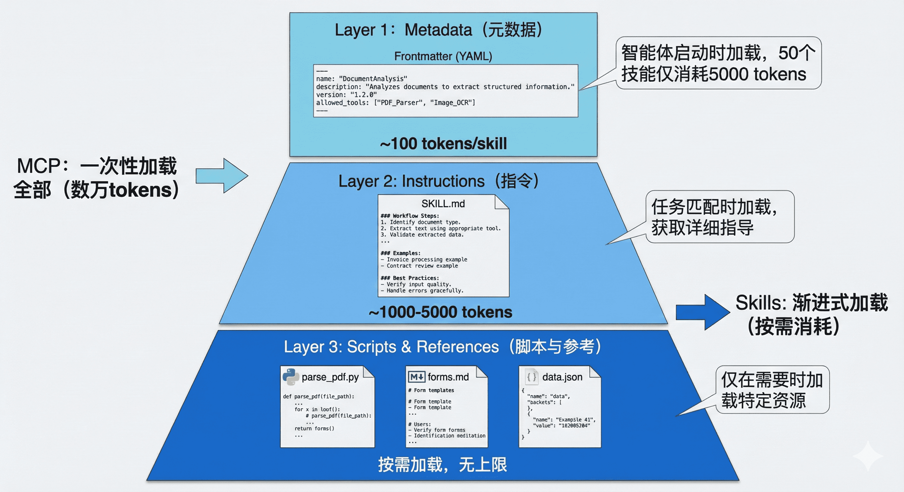
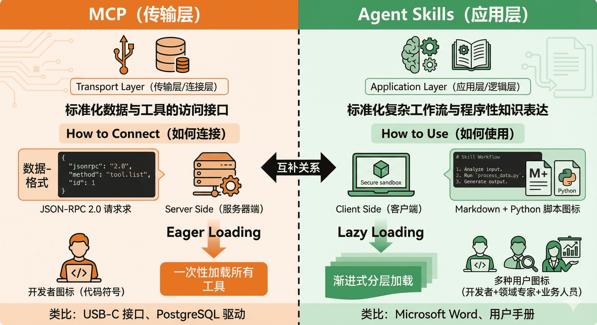
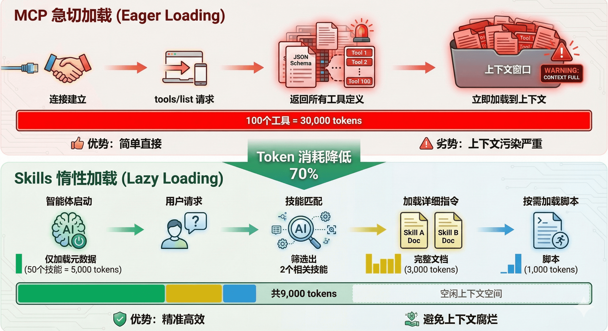
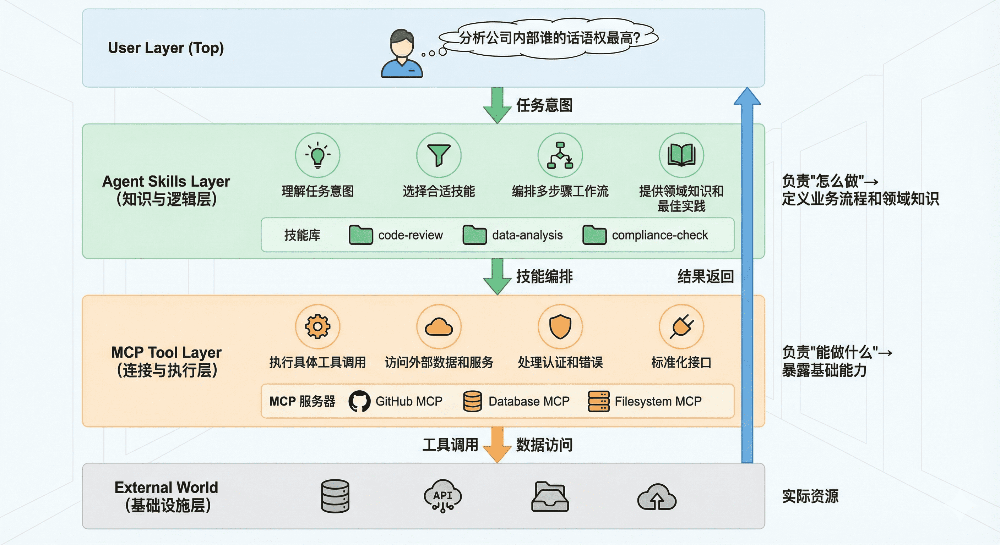
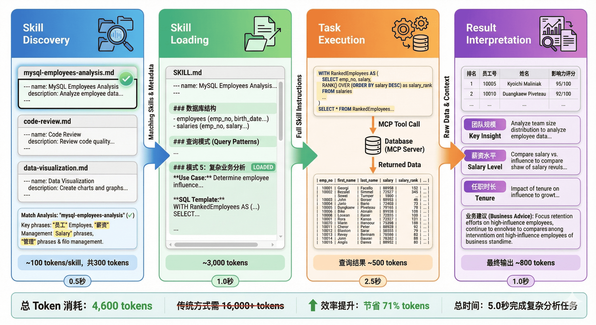
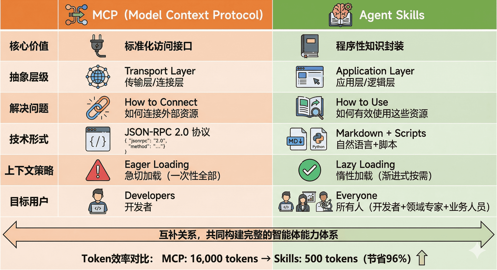

# Agent Skills 与 MCP：智能体能力扩展的两种范式

## 引言：MCP 之后，我们还需要什么？

在第十章中，我们深入探讨了 MCP（Model Context Protocol）如何通过标准化协议解决智能体与外部工具的连接问题。你已经学会了如何让智能体通过 MCP 访问数据库、文件系统、API 服务等各种资源。让我们回顾一个典型的 MCP 使用场景：

```python
from hello_agents import ReActAgent, HelloAgentsLLM
from hello_agents.tools import MCPTool

llm = HelloAgentsLLM()
agent = ReActAgent(name="数据分析助手", llm=llm)

# 连接到数据库 MCP 服务器
db_mcp = MCPTool(server_command=["python", "database_mcp_server.py"])
agent.add_tool(db_mcp)

# 智能体现在可以访问数据库了
response = agent.run("查询员工表中薪资最高的前10名员工")
```

这段代码工作得很好，智能体成功连接到了数据库。但当你尝试处理更复杂的任务时，会发现一些微妙的问题：

```python
# 一个更复杂的需求
response = agent.run("""
分析公司内部谁的话语权最高？
需要综合考虑：
1. 管理层级和下属数量
2. 薪资水平和涨薪幅度
3. 任职时长和稳定性
4. 跨部门影响力
""")
```

这个任务需要执行多次数据库查询，每次查询的结果会影响下一次查询的策略。更关键的是，它需要智能体具备<strong>领域知识</strong>：知道如何衡量"话语权"，知道应该从哪些维度分析数据，知道如何组合多个查询结果得出结论。


此时，你会遇到两个根本性的问题：

<strong>第一个问题是上下文爆炸</strong>。为了让智能体能够灵活查询数据库，MCP 服务器通常会暴露数十甚至上百个工具（不同的表、不同的查询方法）。这些工具的完整 JSON Schema 在连接建立时就会被加载到系统提示词中，可能占用数万个 token。据社区开发者反馈，仅加载一个 Playwright MCP 服务器就会占用 200k 上下文窗口的 8%，这在多轮对话中会迅速累积，导致成本飙升和推理能力下降。

<strong>第二个问题是能力鸿沟</strong>。MCP 解决了"能够连接"的问题，但没有解决"知道如何使用"的问题。拥有数据库连接能力，不等于智能体知道如何编写高效且安全的 SQL；能够访问文件系统，不意味着它理解特定项目的代码结构和开发规范。这就像给一个新手程序员开通了所有系统的访问权限，但没有提供操作手册和最佳实践。

这正是 <strong>Agent Skills</strong> 要解决的核心问题。2025年初，Anthropic 在推出 MCP 之后，进一步提出了 Agent Skills 的概念，引发了业界的广泛关注。有开发者评论说："Skills 和 MCP 是两种东西，Skills 是领域知识，告诉模型该如何做，本质上是高级 Prompt；而 MCP 对接外部工具和数据。" 也有人认为："从 Function Call 到 Tool Call 到 MCP 到 Skills，核心大差不差，就是工程实践和表现形式的优化演进。"

那么，Agent Skills 到底是什么？它与 MCP 有何本质区别？两者是竞争关系还是互补关系？本章将深入探讨这些问题。


## 什么是 Agent Skills？

### 核心设计理念

<strong>Agent Skills 是一种标准化的程序性知识封装格式</strong>。如果说 MCP 为智能体提供了"手"来操作工具，那么 Skills 就提供了"操作手册"或"SOP（标准作业程序）"，教导智能体如何正确使用这些工具。

这种设计理念源于一个简单但深刻的洞察：<strong>连接性（Connectivity）与能力（Capability）应该分离</strong>。MCP 专注于前者，Skills 专注于后者。这种职责分离带来了清晰的架构优势：

- <strong>MCP 的职责</strong>：提供标准化的访问接口，让智能体能够"够得着"外部世界的数据和工具
- <strong>Skills 的职责</strong>：提供领域专业知识，告诉智能体在特定场景下"如何组合使用这些工具"

用一个类比来理解：MCP 像是 USB 接口或驱动程序，它定义了设备如何连接；而 Skills 像是软件应用程序，它定义了如何使用这些连接的设备来完成具体任务。你可以拥有一个功能完善的打印机驱动（MCP），但如果没有告诉你如何在 Word 里设置页边距和双面打印（Skill），你仍然无法高效地完成打印任务。

### 渐进式披露：破解上下文困境

Agent Skills 最核心的创新是<strong>渐进式披露（Progressive Disclosure）机制</strong>。这种机制将技能信息分为三个层次，智能体按需逐步加载，既确保必要时不遗漏细节，又避免一次性将过多内容塞入上下文窗口。

<div align="center">
  
  <p>图 1 Agent Skills 渐进式披露三层架构</p>
</div>


#### 第一层：元数据（Metadata）

在 Skills 的设计中，每个技能都存放在一个独立的文件夹中，核心是一个名为 `SKILL.md` 的 Markdown 文件。这个文件必须以 YAML 格式的 Frontmatter 开头，定义技能的基本信息。

当智能体启动时，它会扫描所有已安装的技能文件夹，<strong>仅读取每个 `SKILL.md` 的 Frontmatter 部分</strong>，将这些元数据加载到系统提示词中。根据实测数据，每个技能的元数据仅消耗约 <strong>100 个 token</strong>。即使你安装了 50 个技能，初始的上下文消耗也只有约 5,000 个 token。

这与 MCP 的工作方式形成了鲜明对比。在典型的 MCP 实现中，当客户端连接到一个服务器时，通常会通过 `tools/list` 请求获取所有可用工具的完整 JSON Schema，可能立即消耗数万个 token。

#### 第二层：技能主体（Instructions）

当智能体通过分析用户请求，判断某个技能与当前任务高度相关时，它会进入第二层加载。此时，智能体会读取该技能的完整 `SKILL.md` 文件内容，将详细的指令、注意事项、示例等加载到上下文中。

此时，智能体获得了完成任务所需的全部上下文：数据库结构、查询模式、注意事项等。这部分内容的 token 消耗取决于指令的复杂度，通常在 1,000 到 5,000 个 token 之间。

#### 第三层：附加资源（Scripts & References）

对于更复杂的技能，`SKILL.md` 可以引用同一文件夹下的其他文件：脚本、配置文件、参考文档等。智能体<strong>仅在需要时才加载这些资源</strong>。

例如，一个 PDF 处理技能的文件结构可能是：

```
skills/pdf-processing/
├── SKILL.md              # 主技能文件
├── parse_pdf.py          # PDF 解析脚本
├── forms.md              # 表单填写指南（仅在填表任务时加载）
└── templates/            # PDF 模板文件
    ├── invoice.pdf
    └── report.pdf
```

在 `SKILL.md` 中，可以这样引用附加资源：

- 当需要执行 PDF 解析时，智能体会运行 `parse_pdf.py` 脚本
- 当遇到表单填写任务时，才会加载 `forms.md` 了解详细步骤
- 模板文件只在需要生成特定格式文档时访问

这种设计有两个关键优势：

1. <strong>无限的知识容量</strong>：通过脚本和外部文件，技能可以"携带"远超上下文限制的知识。例如，一个数据分析技能可以附带一个 1GB 的数据文件和一个查询脚本，智能体通过执行脚本来访问数据，而无需将整个数据集加载到上下文中。

2. <strong>确定性执行</strong>：复杂的计算、数据转换、格式解析等任务交给代码执行，避免了 LLM 生成过程中的不确定性和幻觉问题。

### 渐进式披露的效果：从 16k 到 500 Token

社区开发者分享的实践案例充分证明了渐进式披露的威力。在一个真实场景中：

- <strong>传统 MCP 方式</strong>：直接连接一个包含大量工具定义的 MCP 服务器，初始加载消耗 <strong>16,000 个 token</strong>
- <strong>Skills 包装后</strong>：创建一个简单的 Skill 作为"网关"，仅在 Frontmatter 中描述功能，初始消耗仅 <strong>500 个 token</strong>

当智能体确定需要使用该技能时，才会加载详细指令并按需调用底层的 MCP 工具。这种架构不仅大幅降低了初始成本，还使得对话过程中的上下文管理更加精准和高效。

## Agent Skills vs MCP：本质区别与协作关系

现在，我们可以系统地比较这两种技术的本质区别了。

<div align="center">
  
  <p>图 2 MCP 与 Agent Skills 设计哲学对比</p>
</div>

### 从工程视角理解差异

让我们通过一个具体的例子来理解这种差异。假设你要构建一个智能体来帮助团队进行代码审查：

<strong>MCP 的职责</strong>：

```python
# MCP 提供对 GitHub 的标准化访问
github_mcp = MCPTool(server_command=["npx", "-y", "@modelcontextprotocol/server-github"])

# MCP 暴露的工具（简化示例）：
# - list_pull_requests(repo, state)
# - get_pull_request_details(pr_number)
# - list_pr_comments(pr_number)
# - create_pr_comment(pr_number, body)
# - get_file_content(repo, path, ref)
# - list_pr_files(pr_number)
```

MCP 让智能体"能够"访问 GitHub，能够调用这些 API。但它不知道"应该"做什么。

<strong>Skills 的职责</strong>：

```markdown
---
name: code-review-workflow
description: 执行标准的代码审查流程，包括检查代码风格、安全问题、测试覆盖率等
---

# 代码审查工作流

## 审查清单

当执行代码审查时，按以下步骤进行：

1. **获取 PR 信息**：调用 `get_pull_request_details` 了解变更背景
2. **分析变更文件**：调用 `list_pr_files` 获取文件列表
3. **逐文件审查**：
   - 对于 `.py` 文件：检查是否符合 PEP 8，是否有明显的性能问题
   - 对于 `.js/.ts` 文件：检查是否有未处理的 Promise，是否使用了废弃的 API
   - 对于测试文件：验证是否覆盖了新增的代码路径
4. **安全检查**：
   - 是否硬编码了敏感信息（密钥、密码）
   - 是否有 SQL 注入或 XSS 风险
5. **提供反馈**：
   - 严重问题：使用 `create_pr_comment` 直接评论
   - 建议改进：在总结中提出

## 公司特定规范

- 所有数据库查询必须使用参数化查询
- API 端点必须有权限验证装饰器
- 新功能必须附带单元测试（覆盖率 > 80%）

## 示例评论模板

**严重问题**：

⚠️ 安全风险：第 45 行直接拼接 SQL 字符串，存在注入风险。
建议改用参数化查询：`cursor.execute("SELECT * FROM users WHERE id = ?", (user_id,))`

```

Skills 告诉智能体"应该"做什么、如何组织审查流程、需要关注哪些公司特定的规范。它是领域知识和最佳实践的容器。


### 上下文管理策略的本质差异

<div align="center">
  
  <p>图 3 MCP 急切加载 vs Skills 惰性加载对比</p>
</div>


### 互补而非竞争：Skills + MCP 的混合架构

理解了两者的差异后，我们会发现：<strong>Skills 和 MCP 不是竞争关系，而是互补关系</strong>。最佳实践是将两者结合，形成分层架构：

<div align="center">
  
  <p>图 4 Skills + MCP 混合架构设计</p>
</div>
<strong>典型工作流</strong>：

1. 用户问："分析公司内部谁的话语权最高"
2. <strong>Skills 层</strong>识别这是一个数据分析任务，加载 `mysql-employees-analysis` 技能
3. <strong>Skills 层</strong>根据技能指令，将任务分解为子步骤：查询管理关系、薪资对比、任职时长等
4. <strong>MCP 层</strong>执行具体的 SQL 查询，返回结果
5. <strong>Skills 层</strong>根据技能中的领域知识，解读数据并生成综合分析
6. 返回结构化的答案给用户

这种架构的优势是：

- <strong>关注点分离</strong>：MCP 专注于"能力"，Skills 专注于"智慧"
- <strong>成本优化</strong>：渐进式加载大幅降低 token 消耗
- <strong>可维护性</strong>：业务逻辑（Skills）与基础设施（MCP）解耦
- <strong>复用性</strong>：同一个 MCP 服务器可以被多个 Skills 使用

## 技术实现：如何创建和使用 Skills

### SKILL.md 规范详解

让我们深入了解 `SKILL.md` 文件的标准结构：

```markdown
---
# === 必需字段 ===
name: skill-name
  # 技能的唯一标识符，使用 kebab-case 命名

description: >
  简洁但精确的描述，说明：
  1. 这个技能做什么
  2. 什么时候应该使用它
  3. 它的核心价值是什么
  # 注意：description 是智能体选择技能的唯一依据，必须写清楚！

# === 可选字段 ===
version: 1.0.0
  # 语义化版本号

allowed_tools: [tool1, tool2]
  # 此技能可以调用的工具列表（白名单）

required_context: [context_item1]
  # 此技能需要的上下文信息

license: MIT
  # 许可协议

author: Your Name <email@example.com>
  # 作者信息

tags: [database, analysis, sql]
  # 便于分类和搜索的标签
---

# 技能标题

## 概述
（对技能的详细介绍，包括使用场景、技术背景等）

## 前置条件
（使用此技能需要的环境配置、依赖项等）

## 工作流程
（详细的步骤说明，告诉智能体如何执行任务）

## 最佳实践
（经验总结、注意事项、常见陷阱等）

## 示例
（具体的使用案例，帮助智能体理解）

## 故障排查
（常见问题和解决方案）
```

### 编写高质量 Skills 的原则

根据 Anthropic 官方文档和社区最佳实践，编写有效的 Skills 需要遵循以下原则：

#### 1. 精准的 Description

`description` 是智能体决策的关键。它应该：

- <strong>精确定义适用范围</strong>：避免模糊的描述如"帮助处理数据"
- <strong>包含触发关键词</strong>：让智能体能够匹配用户意图
- <strong>说明独特价值</strong>：与其他技能区分开来

❌ <strong>不好的 description</strong>：
```yaml
description: 处理数据库查询
```

✅ <strong>好的 description</strong>：
```yaml
description: >
  将中文业务问题转换为 SQL 查询并分析 MySQL employees 示例数据库。
  适用于员工信息查询、薪资统计、部门分析、职位变动历史等场景。
  当用户询问关于员工、薪资、部门的数据时使用此技能。
```

#### 2. 模块化与单一职责

一个 Skill 应该专注于一个明确的领域或任务类型。如果一个 Skill 试图做太多事情，会导致：

- Description 过于宽泛，匹配精度下降
- 指令内容过长，浪费上下文
- 难以维护和更新

<strong>建议</strong>：与其创建一个"通用数据分析"技能，不如创建多个专门的技能：
- `mysql-employees-analysis`：专门分析 employees 数据库
- `sales-data-analysis`：专门分析销售数据
- `user-behavior-analysis`：专门分析用户行为数据

#### 3. 确定性优先原则

对于复杂的、需要精确执行的任务，优先使用脚本而不是依赖 LLM 生成。例如，在数据导出场景中，与其让 LLM 生成 Excel 二进制内容（容易出错），不如编写一个专门的脚本来处理这个任务，SKILL.md 中只需要指导智能体何时调用这个脚本即可。

#### 4. 渐进式披露策略

合理利用三层结构，将信息按重要性和使用频率分层：

- <strong>SKILL.md 主体</strong>：放置核心工作流、常用模式
- <strong>附加文档</strong>（如 `advanced.md`）：放置高级用法、边缘情况
- <strong>数据文件</strong>：放置大型参考数据，通过脚本按需查询

### 实践案例：MySQL 员工分析 Skill 详解

让我们通过 Anthropic 社区的一个真实案例，了解 Agent Skills 的具体应用。这个技能用于分析 MySQL 官方的 `employees` 示例数据库。

#### 技能文件结构

```
skills/mysql-employees-analysis/
├── SKILL.md          # 主技能文件（包含元数据和详细指令）
└── db_schema.sql     # 数据库结构参考（可选，按需加载）
```

#### SKILL.md 核心内容示例

这个技能的 Frontmatter（元数据层）：

```markdown
---
name: mysql-employees-analysis
description: >
  将中文业务问题转换为 SQL 查询并分析 MySQL employees 示例数据库。
  适用于员工信息查询（如"工号12345的员工信息"）、
  薪资统计（如"平均薪资最高的部门"）、
  部门分析（如"各部门人数分布"）、
  职位变动历史（如"某员工的晋升路径"）等场景。
version: 1.0.0
allowed_tools: [execute_sql]
tags: [database, mysql, sql, employees, analysis]
---

# MySQL 员工数据库分析技能

## 概述

这个技能专门用于分析 MySQL 官方提供的 `employees` 示例数据库。
该数据库包含约 300,000 名虚拟员工的记录，涵盖 1985-2000 年的数据。

**核心能力**：
- 理解中文自然语言的业务问题
- 转换为高效的 SQL 查询
- 执行查询并解读结果
- 提供业务洞察和数据解读

## 数据库结构

### 核心表结构

| 表名           | 说明         | 关键字段                                                     |
| -------------- | ------------ | ------------------------------------------------------------ |
| `employees`    | 员工基本信息 | emp_no, birth_date, first_name, last_name, gender, hire_date |
| `salaries`     | 薪资历史     | emp_no, salary, from_date, to_date                           |
| `titles`       | 职位历史     | emp_no, title, from_date, to_date                            |
| `dept_emp`     | 员工部门关系 | emp_no, dept_no, from_date, to_date                          |
| `dept_manager` | 部门经理     | emp_no, dept_no, from_date, to_date                          |
| `departments`  | 部门信息     | dept_no, dept_name                                           |

### 关键约定

⚠️ **重要**：`to_date = '9999-01-01'` 表示"当前有效"的记录。
查询"当前"状态时（如现任员工、当前薪资），必须加此过滤条件。

完整的表结构参见：`db_schema.sql`

## 工作流程

### 第一步：理解需求

仔细分析用户的中文描述，识别：
- **查询目标**：要查什么数据？（员工、薪资、部门...）
- **筛选条件**：有什么限制？（特定部门、时间范围、薪资区间...）
- **聚合维度**：需要统计吗？（平均值、总数、排名...）
- **时间范围**：是历史数据还是当前状态？

### 第二步：构建 SQL

根据需求选择合适的查询模式（见下方"常见查询模式"）。

**编写原则**：
1. 使用明确的表别名（如 `e` for employees）
2. JOIN 时优先使用主键/外键
3. 注意日期过滤（特别是 `to_date`）
4. 合理使用索引字段
5. 大结果集要加 LIMIT

### 第三步：执行查询

调用 `execute_sql` 工具执行构建好的 SQL。

```python
# 示例调用（智能体会自动转换为工具调用）
result = execute_sql(query="SELECT ...")


### 第四步：解读结果

将查询结果转化为自然语言回答：
- 用表格呈现结构化数据
- 突出关键数据点
- 提供业务洞察（如趋势、异常）
- 如果结果为空，说明可能的原因

## 常见查询模式

### 模式 1：基础信息查询


-- 查询特定员工的基本信息
SELECT emp_no, CONCAT(first_name, ' ', last_name) AS full_name,
       gender, birth_date, hire_date
FROM employees
WHERE emp_no = <员工号>;


### 模式 2：当前状态查询


-- 查询当前薪资最高的员工（TOP 10）
SELECT e.emp_no,
       CONCAT(e.first_name, ' ', e.last_name) AS name,
       s.salary
FROM employees e
JOIN salaries s ON e.emp_no = s.emp_no
WHERE s.to_date = '9999-01-01'  -- 当前薪资
ORDER BY s.salary DESC
LIMIT 10;


### 模式 3：历史趋势分析


-- 查询某员工的薪资变化历史
SELECT emp_no, salary, from_date, to_date,
       salary - LAG(salary) OVER (ORDER BY from_date) AS increase
FROM salaries
WHERE emp_no = <员工号>
ORDER BY from_date;


### 模式 4：跨表关联查询


-- 查询各部门的平均薪资（当前）
SELECT d.dept_name,
       COUNT(DISTINCT de.emp_no) AS emp_count,
       ROUND(AVG(s.salary), 2) AS avg_salary
FROM departments d
JOIN dept_emp de ON d.dept_no = de.dept_no
JOIN salaries s ON de.emp_no = s.emp_no
WHERE de.to_date = '9999-01-01'  -- 当前在职
  AND s.to_date = '9999-01-01'   -- 当前薪资
GROUP BY d.dept_name
ORDER BY avg_salary DESC;


### 模式 5：复杂业务分析


-- 分析"话语权"：综合管理层级、薪资、任职时长
WITH manager_hierarchy AS (
    -- 统计每个经理管理的下属数
    SELECT dm.emp_no, COUNT(de.emp_no) AS subordinate_count
    FROM dept_manager dm
    JOIN dept_emp de ON dm.dept_no = de.dept_no
    WHERE dm.to_date = '9999-01-01'
      AND de.to_date = '9999-01-01'
      AND de.emp_no != dm.emp_no
    GROUP BY dm.emp_no
),
current_salary AS (
    -- 当前薪资
    SELECT emp_no, salary
    FROM salaries
    WHERE to_date = '9999-01-01'
),
tenure AS (
    -- 任职时长（年）
    SELECT emp_no,
           TIMESTAMPDIFF(YEAR, hire_date, CURDATE()) AS years_employed
    FROM employees
)
SELECT e.emp_no,
       CONCAT(e.first_name, ' ', e.last_name) AS name,
       COALESCE(mh.subordinate_count, 0) AS team_size,
       cs.salary,
       t.years_employed,
       -- 简单的话语权评分（可根据业务调整权重）
       (COALESCE(mh.subordinate_count, 0) * 10 +
        cs.salary / 1000 +
        t.years_employed * 5) AS influence_score
FROM employees e
JOIN current_salary cs ON e.emp_no = cs.emp_no
JOIN tenure t ON e.emp_no = t.emp_no
LEFT JOIN manager_hierarchy mh ON e.emp_no = mh.emp_no
WHERE cs.salary > 60000  -- 过滤低薪员工
ORDER BY influence_score DESC
LIMIT 20;


## 注意事项

### ⚠️ 时间字段的正确处理

- <strong>当前状态</strong>：必须使用 `to_date = '9999-01-01'` 过滤
- <strong>历史查询</strong>：注意 `from_date` 和 `to_date` 的范围
- <strong>时间计算</strong>：使用 `TIMESTAMPDIFF`、`DATEDIFF` 等函数

### ⚠️ 性能优化

- <strong>大表 JOIN</strong>：优先使用索引字段（emp_no, dept_no）
- <strong>聚合查询</strong>：合理使用 GROUP BY 和 HAVING
- <strong>结果限制</strong>：对于展示类查询，添加 LIMIT 限制
- <strong>子查询优化</strong>：复杂查询使用 WITH (CTE) 提高可读性和性能

### ⚠️ 数据质量

- <strong>NULL 值处理</strong>：使用 COALESCE 或 IFNULL 处理空值
- <strong>重复记录</strong>：注意员工可能多次调岗，查询时考虑去重
- <strong>数据范围</strong>：数据库只包含 1985-2000 年的数据，查询时注意时间边界

## 故障排查

<strong>问题 1：查询结果为空</strong>
- 检查是否正确使用了 `to_date = '9999-01-01'`
- 验证员工号或部门号是否存在
- 检查日期范围是否合理

<strong>问题 2：查询速度慢</strong>
- 检查是否缺少索引字段的 WHERE 条件
- 考虑将复杂查询拆分为多步
- 使用 EXPLAIN 分析查询计划

<strong>问题 3：统计数据不准确</strong>
- 注意区分"历史"和"当前"状态
- 检查 JOIN 条件是否遗漏
- 验证聚合函数的使用是否正确
```

这个 SKILL.md 文件展示了一个完整技能的结构：
- 清晰的元数据（智能体用于发现和匹配）
- 完整的数据库结构说明
- 详细的工作流程指导
- 丰富的查询模式示例（可直接复用的 SQL 模板）
- 实用的注意事项和故障排查

#### 技能的使用效果

当用户向支持 Agent Skills 的智能体（如 Claude Desktop、Claude Code）提问时：

**用户问题**：
> "分析公司内部谁的话语权最高？需要综合考虑管理层级、薪资水平和任职时长。"

<div align="center">
  
  <p>图 5 Agent Skills 完整工作流程示意</p>
</div>


**输出示例**：

| 排名 | 员工号 | 姓名                 | 团队规模 | 薪资    | 任职年限 | 影响力评分 |
| ---- | ------ | -------------------- | -------- | ------- | -------- | ---------- |
| 1    | 110022 | Margareta Markovitch | 45       | 152,710 | 18       | 692.71     |
| 2    | 110039 | Vishwani Minakawa    | 38       | 138,273 | 16       | 598.27     |
| 3    | 110085 | Ebru Alpin           | 32       | 124,054 | 15       | 519.05     |

**关键洞察**：
1. 话语权最高的员工通常管理大团队（30+人）、薪资前1%（>12万）、任职超15年
2. 部门经理的影响力远超普通员工，管理规模是关键因素
3. 长期任职的高薪员工即使不担任管理职务，也具有较强的话语权

整个过程中，技能提供了：
- **领域知识**：如何衡量"话语权"（管理规模+薪资+任职时长）
- **技术指导**：如何编写高效的 SQL（使用 CTE、窗口函数、多表 JOIN）
- **业务理解**：如何解读数据并生成洞察


### Skills 的分享与复用

Agent Skills 的另一个重要特性是**社区化**。Anthropic 建立了官方的 Skills 仓库：

**官方技能库**：https://github.com/anthropics/skills

截至 2025 年，已有数百个社区贡献的技能，覆盖：

- **开发工具**：前端设计、API 测试、代码审查、Git 工作流
- **数据分析**：SQL 查询、数据可视化、统计分析
- **文档处理**：PDF 解析、Markdown 生成、技术文档撰写
- **业务流程**：项目管理、客户支持、合规审查

使用社区技能非常简单：

```bash
# 克隆官方技能库
git clone https://github.com/anthropics/skills.git

# 复制需要的技能到你的项目
cp -r skills/frontend-design ./my-project/skills/

# 智能体会自动发现并加载
```

你也可以分享自己的技能：

```bash
# 发布到 GitHub
cd my-custom-skill
git init
git add SKILL.md
git commit -m "Add custom SQL analysis skill"
git remote add origin https://github.com/yourname/my-skill.git
git push -u origin main

# 其他开发者可以直接使用
# git clone https://github.com/yourname/my-skill.git
```

## 行业动态与生态演进

### 标准化进程与厂商支持

Agent Skills 虽然由 Anthropic 提出，但其设计理念正在影响整个行业。

**Anthropic Claude**：
- Claude Desktop 和 Claude Code 原生支持 Skills
- 提供官方 SDK 和开发工具
- 维护官方技能库

**OpenAI 的响应**：
虽然 OpenAI 尚未官方采用 "Skills" 这个术语，但在 2025 年 3 月的更新中，ChatGPT 引入了类似的概念：

- **Custom Instructions 增强**：支持更复杂的多步骤指令
- **Memory 与 Context Profiles**：允许用户保存和复用特定领域的知识
- **GPTs 的"知识库"功能**：可以附加文档和脚本，按需加载

这些功能本质上是 Skills 理念的不同实现形式。

**Google Vertex AI**：
Google 在 Gemini 模型中引入了 **"Grounding with Functions"**，允许开发者定义"函数包"（Function Packages），每个包包含：

- 函数定义（类似 MCP 的 tools）
- 使用指南（类似 Skills 的 instructions）
- 示例（examples）

这种设计与 Skills + MCP 的混合架构高度相似。


### 分层架构的必然性

综合各方观点，我们认为：**Skills 和 MCP 代表了智能体架构中两个必然分离的层级**。随着智能体系统的复杂度增加，这种分层是不可避免的：

```
应用层（Application Layer）
  ↓ Agent Skills
  ↓ 领域知识、工作流、最佳实践

传输层（Transport Layer）
  ↓ MCP
  ↓ 标准化接口、工具调用、资源访问

基础设施层（Infrastructure Layer）
  ↓ 数据库、API、文件系统、外部服务
```

这与传统软件架构的演进路径完全一致（从单体到分层到微服务），只是在 AI 领域重新演绎了一遍。


### 标准化的趋势

随着行业对智能体技术的重视，我们预见以下趋势：

**1. 协议融合**

未来可能出现统一的智能体能力描述协议，融合 MCP 的连接性和 Skills 的知识表达：

```yaml
# 未来的统一协议示例（假想）
apiVersion: agent.io/v1
kind: Capability
metadata:
  name: enterprise-data-analysis
spec:
  transport:
    protocol: mcp
    server: database-mcp-server
    tools: [query, schema]
  knowledge:
    type: skill
    workflow: data-analysis-workflow.md
    examples: examples/
```

**2. 市场化与生态系统**

类似于 NPM、PyPI，未来可能出现智能体能力的包管理系统：

```bash
# 假想的未来命令
agent-cli install @anthropic/frontend-design-skill
agent-cli install @google/data-analysis-suite
agent-cli install @openai/code-review-assistant
```

开发者可以发布、分享、售卖自己的 Skills 和 MCP 服务器，形成繁荣的生态系统。

**3. 自动化能力发现**

智能体可能发展出自动发现和学习新能力的机制：

```python
# 未来的智能体可能具备自主学习能力
agent = SelfEvolvingAgent()

# 智能体在执行任务时发现缺少某种能力
response = agent.run("生成 3D 建模文件")

# 智能体自动搜索并安装相关 Skill
# [内部日志] 检测到未知任务类型：3D建模
# [内部日志] 搜索技能库...发现 "blender-3d-modeling" skill
# [内部日志] 请求用户授权安装...已授权
# [内部日志] 技能安装完成，重新执行任务
```

### 挑战与风险

与此同时，我们也需要警惕潜在的风险：

<strong>安全性挑战</strong>：
- Skills 包含可执行脚本，存在代码注入风险
- MCP 服务器可能暴露敏感数据接口
- 第三方技能的可信度难以验证

<strong>上下文污染</strong>：
- 随着 Skills 数量增加，即使是元数据也可能占用大量上下文
- 需要更智能的技能索引和检索机制

<strong>碎片化风险</strong>：
- 虽然 MCP 正在标准化，但 Skills 格式尚未统一
- 不同厂商可能推出不兼容的 Skills 规范


## 总结

Agent Skills 和 MCP 代表了智能体技术栈中两个关键的抽象层：

- <strong>MCP（Model Context Protocol）</strong>：解决"连接性"问题，是智能体与外部世界交互的标准化接口，相当于"神经系统"或"双手"
- <strong>Agent Skills</strong>：解决"能力"问题，是领域知识和工作流的封装，相当于"大脑皮层"或"操作手册"

两者不是竞争关系，而是互补关系：

<div align="center">
  
  <p>图 6 MCP 与 Agent Skills 全面对比总结</p>
</div>


<strong>关键洞察</strong>：

1. <strong>分层架构是必然趋势</strong>：随着智能体系统复杂度增加，"连接层"和"知识层"的分离是不可避免的

2. <strong>上下文效率是核心矛盾</strong>：Skills 的渐进式披露机制将 token 消耗降低 90% 以上，这是其最大的技术优势

3. <strong>领域知识的民主化</strong>：Skills 让非开发者也能贡献智能体能力，这将极大拓展 AI 应用的边界

4. <strong>混合架构是最佳实践</strong>：在企业级应用中，MCP 提供基础设施连接，Skills 提供业务逻辑，两者结合才能构建高效、可维护的智能体系统

<strong>实践建议</strong>：

- 对于<strong>外部服务连接</strong>（数据库、API、云服务），优先使用 MCP
- 对于<strong>复杂工作流</strong>（多步骤任务、领域专业知识），优先使用 Skills
- 在<strong>上下文受限</strong>的场景（长对话、大量工具），使用 Skills 进行渐进式管理
- 构建<strong>企业级智能体</strong>时，采用 MCP + Skills 的分层架构

通过本章的学习，你应该能够：
- 理解 Agent Skills 和 MCP 的本质区别与协作关系
- 掌握 Skills 的渐进式披露机制及其优势
- 编写高质量的 SKILL.md 文件
- 在实际项目中合理选择和组合两种技术
- 构建分层清晰、高效可维护的智能体系统

智能体技术仍在快速演进中。MCP 已成为连接层的事实标准，Skills 的理念也在影响整个行业。掌握这两种技术，将帮助你在 AI 浪潮中构建更强大、更实用的智能体应用。

---

## 参考资料

1. Anthropic Agent Skills 官方文档：https://docs.anthropic.com/en/docs/agent-skills
2. Anthropic Skills GitHub 仓库：https://github.com/anthropics/skills
3. Model Context Protocol 规范：https://modelcontextprotocol.io/
4. Anthropic 博客：Improving Frontend Design Through Skills：https://www.claude.com/blog/improving-frontend-design-through-skills
5. 第十章：智能体通信协议（hello-agents）
