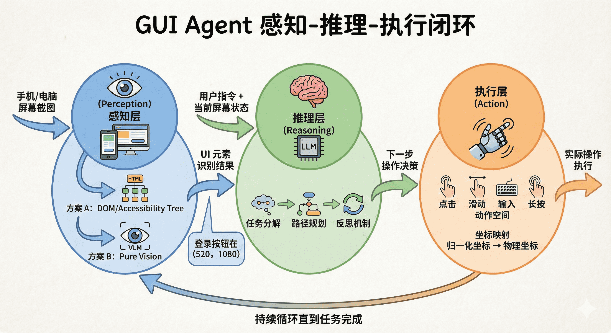
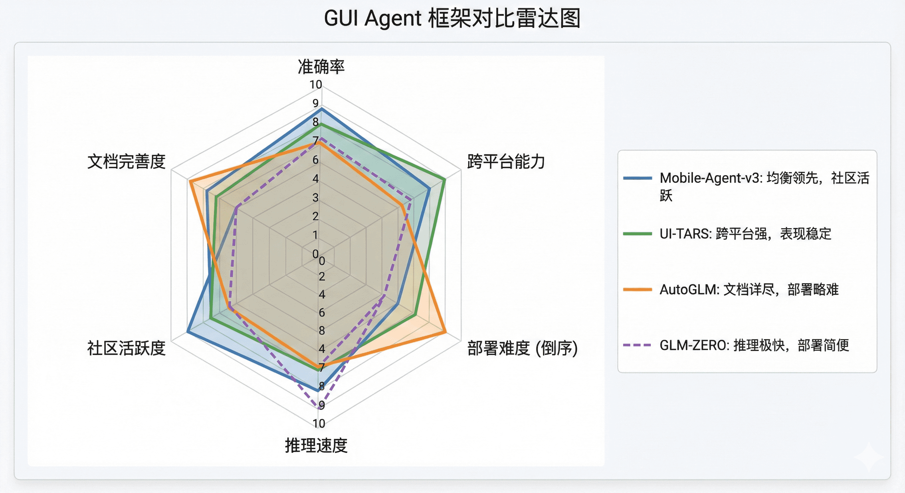
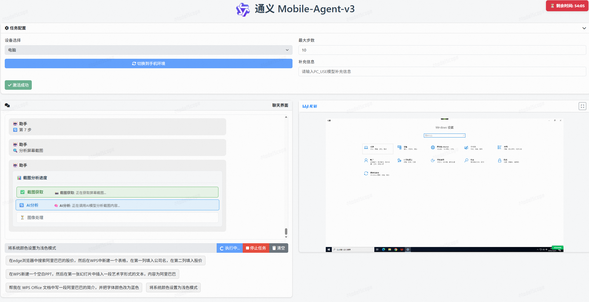
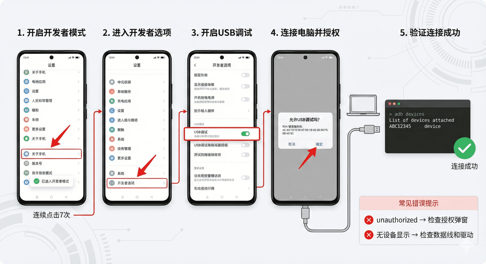

# GUI Agent 科普与实战——下一代人机交互的探索之旅

## 引言：当 AI 学会"看"屏幕

想象一下这样的场景：你对着手机说"帮我订一张明天去上海的高铁票，二等座，上午 10 点左右出发"，然后 AI 自动打开铁路 12306 APP，填写出发地、目的地和日期，筛选符合条件的车次，完成预订并付款——整个过程无需你手动操作，AI 就像一个真实的助手一样，"看"着屏幕，"理解"界面，"点击"按钮。

这不是科幻，而是 **GUI Agent（图形用户界面智能体）** 正在实现的现实。

在过去的二十年中，企业自动化的主流方案是 **RPA（机器人流程自动化）**。然而，RPA 有一个致命弱点：它依赖于固定的 UI 元素选择器（Selectors），一旦界面稍有变化，脚本就会失效。这种脆弱性导致了巨大的维护成本。

而 GUI Agent 的出现，彻底改变了这个局面。它不是简单地"回放"预设的脚本，而是像人类一样，通过**视觉感知**理解屏幕内容，通过**大语言模型的推理能力**规划操作路径，在动态、未知的软件环境中自主完成任务。

本章将带你深入了解 GUI Agent 的技术原理，并通过三个实战案例，让你真正掌握如何使用和部署这些前沿的智能体系统。

## 第一部分：GUI Agent 技术科普

### 1.1 GUI Agent 是什么？

**GUI Agent（图形用户界面智能体）** 是一类能够自主理解和操作图形界面的 AI 系统。与传统的 API 调用或命令行工具不同，GUI Agent 直接与人类使用的图形界面交互——无论是手机 APP、桌面软件还是网页应用。

#### 1.1.1 从 RPA 到 AI Agent 的范式转变

让我们通过一个对比来理解这种转变：

| 维度           | 传统 RPA                                 | GUI Agent（AI Agent）                |
| -------------- | ---------------------------------------- | ------------------------------------ |
| **工作原理**   | 基于固定选择器（如 XPath、ID）的脚本回放 | 基于视觉理解和语言模型推理的自主操作 |
| **适应性**     | 界面变化即失效                           | 能适应界面变化，具备语义弹性         |
| **任务规划**   | 需要人工预设每一步操作                   | 根据自然语言指令自主分解任务         |
| **跨平台能力** | 需要为每个平台编写专门脚本               | 通用视觉方案，天然跨平台             |
| **维护成本**   | 极高（UI 变化需重写脚本）                | 低（模型自动适应）                   |

**核心区别**：RPA 是"脆弱的自动化"，而 GUI Agent 是"智能的自主化"。

#### 1.1.2 为什么 GUI Agent 突然火了？

GUI Agent 的爆发并非偶然，而是多个技术领域同步成熟的结果。首先是多模态大模型的突破性进展。从GPT-4o、Claude 3.5 Sonnet、Qwen-VL 这些模型开始，大模型不仅能理解文字，还能"看懂"图像，这为 GUI Agent 提供了强大的"眼睛"。当你把一张屏幕截图喂给这些模型时，它们能准确识别出"这是一个登录按钮"、"这里有一个搜索框"，甚至能理解复杂的界面布局。

更关键的是定位能力的突破。早期的视觉模型就像一个近视眼——它知道屏幕上有个按钮，但说不清楚按钮在哪里。而最新的模型（如 GUI-Owl、Qwen-VL）经过专门训练，能够精确输出 UI 元素的屏幕坐标 $(x, y)$，这让 Agent 不仅能"看见"，还能"点准"。

最后是推理能力的质变。大语言模型的链式思考（Chain of Thought）能力让 Agent 拥有了"大脑"。它能将"订一张明天的高铁票"这样的模糊指令，分解成"打开APP → 选择日期 → 输入地点 → 筛选车次 → 确认支付"这样的具体步骤，并在执行过程中不断反思和纠错。

### 1.2 GUI Agent 的核心技术架构

一个完整的 GUI Agent 系统可以被分解为三个核心模块：**感知（Perception）** → **推理（Reasoning）** → **执行（Action）**。这是一个闭环的自主决策系统。

<div align="center">
  
  <p>图 1 GUI Agent 的感知-推理-执行闭环</p>
</div>


#### 1.2.1 感知层：机器如何"看见"屏幕

感知层负责将屏幕信息转化为机器可理解的数据。目前主要有两种技术路线，它们代表了两种截然不同的设计哲学。

第一种路线是基于 DOM 或可访问性树的结构化感知。这种方法通过系统 API 获取应用的内部结构——比如网页的 HTML DOM 树，或者 Android 应用的 View Hierarchy。就像是给 Agent 提供了一份"建筑图纸"，它能精确知道每个按钮、文本框的类型和位置。这种方法的优势是精确高效，但问题也很明显：许多现代应用根本不暴露这些结构化信息。Canvas 绘制的界面、游戏、远程桌面软件，对于基于 DOM 的方案来说都是"黑盒"。而且这种方法丢失了视觉布局信息，很难理解元素之间的空间关系，跨平台兼容性也很差。

第二种路线是基于纯视觉的感知，这也是目前最前沿的方向。Agent 直接截取屏幕图像，用视觉大模型（VLM）像人类一样"看"屏幕。这种方法的通用性极强——不管你的界面是用什么技术实现的，只要能显示在屏幕上，Agent 就能理解。更重要的是，它具备"语义弹性"。即使某个按钮从蓝色变成了绿色，或者位置稍微移动了，基于视觉的 Agent 仍然能通过语义识别出"这是登录按钮"。传统 RPA 遇到这种情况就会失效，但 GUI Agent 能轻松应对。当然，纯视觉方案也有挑战，最大的难点是定位精度——模型不仅要识别出按钮是什么，还要输出它的精确屏幕坐标。

#### 1.2.2 推理层：大脑的决策过程

推理层是 GUI Agent 的"大脑"，负责将用户的抽象指令转化为具体的操作序列。这里涉及几个关键能力。

首先是任务分解能力。当你对 Agent 说"帮我订一张明天去上海的高铁票，二等座，上午10点左右出发"，它需要理解这句话背后的复杂逻辑。Agent 会自动将这个模糊的需求拆解成一系列具体步骤：打开 12306 APP → 点击"车票预订" → 输入出发地"北京" → 输入目的地"上海" → 选择日期"明天" → 点击查询 → 筛选车次（二等座+上午10点前后）→ 选择符合条件的车次 → 点击预订 → 填写乘客信息 → 确认支付。这个分解过程依赖于大语言模型对常识和业务流程的理解。

更精妙的是思维链机制。为了提高复杂任务的成功率，现代 GUI Agent 会在每一步操作前生成"内心独白"。比如当前屏幕是 12306 首页，用户目标是预订高铁票，Agent 会先分析："我看到屏幕上有'车票预订'、'订单查询'等选项，需要点击'车票预订'才能进入购票流程。"然后决策："点击坐标 (540, 320) 处的'车票预订'按钮。"这种显式的思考过程不仅让 Agent 的行为更可解释，还能显著降低多步操作中的误差累积。

最后是反思与纠错能力。如果 Agent 点击"查询"按钮后，发现没有出现预期的车次列表，而是弹出"请选择出发日期"的提示，它会立即意识到："我漏掉了选择日期的步骤。"然后调整策略："先点击日期选择器，选择明天的日期，再重新查询。"这种自我修正能力让 Agent 能够应对真实世界中的各种意外情况。

#### 1.2.3 执行层：从决策到行动

执行层是 GUI Agent 的"双手"，负责将模型的决策转化为实际的系统操作。

与文本生成的开放空间不同，GUI 操作的动作空间是有限且明确的。点击、双击、长按、滑动、输入、滚动、拖拽——这些基本动作构成了所有复杂操作的基础。每种动作都有其特定的参数，比如点击需要坐标 (x, y)，滑动需要起点和终点 (x1, y1, x2, y2)，输入需要文本内容。

这里有一个关键的技术细节：坐标系统的转换。视觉模型（如 Qwen-VL）通常输出归一化坐标（0-1000），而实际手机或电脑的屏幕分辨率可能是 1920x1080。执行层必须进行精确的坐标映射，将模型的输出转换成物理坐标。而且不同设备还有不同的 DPI 和系统缩放比例，这些都需要考虑进去。一个简单的映射函数可能是这样的：先将归一化坐标除以 1000，再乘以屏幕的实际宽高，最后取整得到物理坐标。

更复杂的是多平台适配。在 Android 上，所有操作都通过 ADB（Android Debug Bridge）发送指令实现，比如 `adb shell input tap 500 1000` 执行点击，`adb shell input swipe 500 1000 500 500` 执行滑动。在 iOS 上，需要通过 libimobiledevice 或 WDA（WebDriverAgent）来实现类似功能。而在 Windows、Mac、Linux 桌面环境，通常使用 pyautogui、pynput 这样的 Python 库直接控制鼠标和键盘。同一个"点击"动作，在不同平台上的实现方式完全不同，执行层需要为每个平台提供统一的抽象接口。

### 1.3 主流开源框架全景对比

2024-2025年是 GUI Agent 的爆发期，各大科技公司和研究机构纷纷开源了自己的框架。让我们系统地对比几个最具代表性的项目：

<div align="center">
  
  <p>图 2 主流 GUI Agent 框架全景对比雷达图</p>
</div>


### 1.4 应用场景与技术局限

#### 1.4.1 五大典型应用场景

GUI Agent 的应用潜力远超我们的想象。在智能座舱领域，驾驶过程中的语音交互需求正在爆发。想象你在开车时说"导航到最近的咖啡店，并在到达前 10 分钟帮我点一杯拿铁"，GUI Agent 能够跨应用协调导航 APP 和外卖 APP，理解复杂的时间逻辑，还能适应不同品牌车机的UI差异。这正是传统车机系统难以做到的。

在软件测试领域，GUI Agent 带来了革命性的变化。传统的自动化测试依赖 Selenium 等工具，每次 UI 改版都需要更新测试脚本，维护成本极高。而 GUI Agent 能够自适应 UI 变化——即使按钮的位置调整了、颜色改变了，Agent 仍能通过语义识别找到正确的元素。它还能进行视觉回归测试，自动检测 UI 异常，甚至主动进行探索性测试，发现那些人类测试工程师可能忽略的边界情况。

企业级的 RPA 场景是另一个巨大的市场。传统 RPA 无法处理那些没有 API 的老旧系统，但 GUI Agent 可以。从 Excel 提取数据，填入 ERP 系统，发送邮件通知——整个跨系统工作流可以完全自动化。对于那些运行了二三十年、没有任何现代接口的遗留系统，GUI Agent 终于提供了自动化的可能性。

在个人生活中，GUI Agent 可以成为真正的智能助理。定时发布内容到多个社交平台，每天早上自动汇总新闻、天气、日程，记录运动数据和饮食习惯——这些重复性的数字劳动都可以交给 Agent 完成。而对于视障、肢体障碍的用户，GUI Agent 更是打开了新世界的大门。完全通过语音控制手机、智能阅读屏幕内容、将复杂操作转化为简单指令，这些功能正在让技术真正惠及每一个人。

#### 1.4.2 当前技术的三大局限

但我们也必须清醒地认识到，GUI Agent 技术仍处于发展的早期阶段，面临着一些实质性的挑战。

最令人担忧的是安全性与幻觉风险。大语言模型的幻觉问题在 GUI Agent 上可能导致严重后果。用户要求"清理桌面"，Agent 可能误解为删除所有文件；转账操作中的一个数字错误，可能造成经济损失。目前的缓解方案包括：对高风险操作强制要求人工确认，详细记录操作日志并支持回滚，以及在沙箱环境中充分测试。但这些都是权宜之计，从根本上解决模型幻觉问题仍需要时间。

成本与效率问题同样不容忽视。每一步操作都需要调用大模型进行推理，如果使用云端 API，成本会随着调用次数线性增长。一个复杂任务可能需要数十次迭代，整体耗时较长。本地部署小模型能降低成本，但准确率会有所下降。操作缓存、模式识别、混合架构（简单任务用 RPA，复杂任务用 AI）是目前探索的方向，但还没有形成成熟的最佳实践。

最后是准确率瓶颈。即使是最好的系统，在真实场景中的成功率也只有 40-50%。复杂界面的元素定位、动态内容的处理（广告、弹窗）、长链条任务的错误累积，这些都是实实在在的技术难题。突破方向包括更强的视觉大模型、通过强化学习优化操作策略、以及"人在回路"（Human-in-the-loop）的协作设计。但从 50% 提升到 90% 的商业化可用水平，可能还需要一段时间。

---

## 第二部分：GUI Agent 实战教程

理论学习之后，让我们通过两个难度递增的实战案例，真正掌握 GUI Agent 的使用和部署。

### 实战一：Mobile-Agent 在线体验（零门槛）

#### 2.1.1 访问在线 Demo

Mobile-Agent-v3 不仅支持手机，还能操作电脑。如图 3 所示，我们在 ModelScope 的 Demo 页面中，将左上角的设备选择切换为 “电脑”，即可进入 PC Agent 的体验环境。

**选项一：ModelScope Demo**（推荐）
链接：https://modelscope.cn/studios/wangjunyang/Mobile-Agent-v3

**选项二：阿里云百炼**
链接：https://bailian.console.aliyun.com/next?tab=demohouse#/experience/adk-computer-use/pc

这两个平台都提供了**云手机/云电脑环境**，无需本地部署即可体验完整功能。


### 2.1.2 界面功能导览

进入页面后，你将看到如图 3 所示的操作界面。为了确保体验一致，请务必进行以下**关键设置**：

1. **设备选择**：在左上角的下拉菜单中，确认选择 **“电脑”**（而非手机）。
2. **桌面预览**：右侧窗口展示的是云端分配给你的 Windows 10 桌面，预装了 Office、浏览器等基础软件。
3. **交互区**：左下角为指令输入区，Agent 的思考过程（Thinking Process）和操作步骤将显示在上方对话框中。

<div align="center">
  
  <p>图 3 Mobile-Agent-v3 在线 Demo 界面说明</p>
</div>

在这个界面中，你可以直接指挥 Agent 进行办公操作，不过目前使用时间有限时。


### 2.1.3 典型任务演练

根据界面提供的预设能力，建议新手从以下两类任务开始尝试：

- **系统级控制**：尝试让 Agent 修改系统设置。
  - *指令示例*：“将系统颜色设置为**浅色模式**。”
  - *观察点*：Agent 能否像人一样打开“开始菜单 -> 设置 -> 个性化”。
- **跨应用办公**：尝试让 Agent 联动浏览器和办公软件。
  - *指令示例*：“在 Edge 浏览器中搜索阿里巴巴的股价，然后在 WPS 中新建一个表格，填入公司名和当前股价。”
  - *观察点*：Agent 能否准确处理“搜索信息”到“录入信息”的跨软件上下文切换。


### 2.1.4 提示词工程：如何指挥 PC Agent

在 GUI 场景下，高质量的 Prompt 是成功的关键。结合上述办公场景，我们总结了三个核心技巧：

1. **明确应用边界 (Explicit Context)**
   - 避免笼统指令，如“写个简介”。
   - **推荐写法**：“在 **WPS Office 文档**中写一段简介……”
   - *解析*：明确指定软件名称（App Name），能减少 Agent 寻找工具的时间。
2. **步骤链式拆解 (Chain of Steps)**
   - 不要试图用一句话包含所有复杂逻辑。
   - **推荐写法**：“第一步，打开 Edge 搜索……；第二步，确认网页加载完成后，截取数据……；第三步，打开 Excel 粘贴。”
   - *解析*：GUI 操作具有严格的时序性，分步指令能显著降低执行错误率。
3. **视觉属性描述 (Visual Attributes)**
   - Agent 是通过“看”屏幕来操作的，利用视觉特征描述更有效。
   - **推荐写法**：“点击右上角的**蓝色保存按钮**” 或 “将字体颜色改为**红色**”。


#### 2.1.5 在线体验的价值与局限

ModelScope 提供的在线 Demo 最大的价值在于**零门槛体验**。你不需要配置任何环境，不需要准备手机，甚至不需要下载任何软件，就能直接感受到 GUI Agent 的魔力。这对于快速验证想法、了解技术边界非常有帮助。

但在线环境也有其局限性。首先是**隐私问题**，所有操作都在云端虚拟机上进行，你无法访问真实的个人数据。其次是**功能限制**，虚拟环境中只预装了部分常用 APP，无法测试特定的应用场景。最后是**性能差异**，云端推理的延迟会比本地部署稍高。

因此，在线体验适合作为学习和探索的起点，但如果要在真实场景中应用 GUI Agent，你需要尝试本地部署。Mobile-Agent-v3官方提供了一个[教程](https://github.com/X-PLUG/MobileAgent/blob/main/Mobile-Agent-v3/README_zh.md)，可以自行尝试

接下来的实战二，就将带你使用最近**智谱**开源的AutoGLM走进这个更深入的世界。

---

### 实战二：AutoGLM 本地部署与手机实战

在线体验让我们感受到了 GUI Agent 的能力，但真正的力量在于部署在自己的设备上，控制真实的应用。AutoGLM 是一个非常适合个人开发者入门的框架，它的架构清晰，文档完善，部署过程相对简单。

这个实战的目标是在你的电脑上部署 AutoGLM，连接你的 Android 手机，然后让 AI 帮你完成一些真实的任务——比如自动回复微信消息，或者定时刷新某个 APP 获取最新数据。

#### 2.2.1 环境准备：你需要什么

Open-AutoGLM 的部署需要两样核心设备：一台能运行 Python 的电脑，以及一部 Android 手机。电脑的配置并不需要太高，因为 AutoGLM 支持调用云端 API，不一定要在本地运行大模型。如果你打算使用云端 API（如智谱的 GLM-4V），一台普通的笔记本就足够了。但如果你想体验完全本地化的方案，那么一块至少 8GB 显存的 GPU 会让体验好很多。

手机方面，Android 7.0 或更高版本都可以，不需要 Root 权限。iPhone 用户暂时无法使用，因为 iOS 的封闭性导致 ADB 调试方案无法直接应用。

软件环境方面，你需要安装 Python 3.10 或更高版本，以及 ADB（Android Debug Bridge）工具。ADB 是连接电脑和手机的桥梁，所有的屏幕截图、点击、滑动操作都要通过它来实现。

**安装 ADB 工具 (macOS / Linux):** 根据你的系统，在终端执行以下命令：

```bash
# macOS 使用 Homebrew
brew install android-platform-tools

# Linux (Ubuntu/Debian)
sudo apt install android-tools-adb
```

Windows 用户通常可以直接下载 Platform Tools 压缩包并配置环境变量。[参考](https://blog.csdn.net/x2584179909/article/details/108319973)


#### 2.2.2 第一步：安装 Open-AutoGLM

如果你拥有 **Claude Code**，你可以配置 [GLM Coding Plan](https://bigmodel.cn/glm-coding) 后，输入以下提示词快速部署：

```
访问文档，为我安装 AutoGLM
https://raw.githubusercontent.com/zai-org/Open-AutoGLM/refs/heads/main/README.md
```

如果没有类似的CLI，请按照以下手动步骤操作：


打开命令行终端，先克隆 Open-AutoGLM 的代码仓库：

```bash
git clone https://github.com/zai-org/Open-AutoGLM.git
cd Open-AutoGLM
```

接下来安装依赖。除了基础的依赖包，**一定要执行项目的安装命令**，以确保所有模块能被正确调用：

```bash
# 1. 安装基础依赖
pip install -r requirements.txt

# 2. 以编辑模式安装项目本身 (关键步骤)
pip install -e .

# 3. (可选) 如果你是开发者，需要额外安装开发依赖
pip install -e ".[dev]"
```

这个过程通常需要几分钟，取决于你的网络速度。安装完成后，你需要配置 API 密钥。如果使用智谱的 GLM-4V API，先去智谱开放平台注册账号并获取 API Key，然后在项目根目录创建一个 `.env` 文件：

```bash
# .env 文件内容
GLM_API_KEY=your_api_key_here
```


[AutoGLM-Phone-9B · 模型库](https://modelscope.cn/models/ZhipuAI/AutoGLM-Phone-9B)


#### 2.2.3 第二步：连接你的 Android 手机

现在到了关键的一步：让电脑能够"看见"并"控制"你的手机。这需要三个小步骤：开启开发者模式、开启 USB 调试、以及**安装 ADB Keyboard**。

**1. 启用开发者模式 & USB 调试** 在 Android 手机上，进入"设置" → "关于手机"，找到"版本号"，**连续点击 7 次**（或直到出现提示），你会看到"您已处于开发者模式"的提示。 返回设置主界面，进入"开发者选项"，找到"USB 调试"并**开启**。

**2. 安装 ADB Keyboard (必须)** 为了让 AI 能在手机上输入文字，我们需要安装专用的 ADB 键盘。

- 下载地址：https://github.com/senzhk/ADBKeyBoard/raw/master/ADBKeyboard.apk

安装后，记得在手机设置的“输入法”中，启用并切换到 **ADB Keyboard**。

**3. 验证连接** 用 USB 数据线将手机连接到电脑（手机上弹出授权框时点击"允许"）。在电脑终端输入：

Bash

```
adb devices
```

如果一切正常，你会看到设备序列号：

```
List of devices attached
ABC12345    device
```

如果显示 `device`，恭喜你，硬件连接打通了！如果显示 `unauthorized`，请检查手机屏幕是否弹出了授权确认框。


对于 Windows 用户，可能还需要安装手机的驱动程序。大部分品牌的手机（如小米、华为、OPPO）都会在连接电脑时自动安装驱动，但如果遇到问题，可以去官网下载对应的 USB 驱动。

<div align="center">
  
  <p>图 4 Android 手机 ADB 连接完整配置流程</p>
</div>


#### 2.2.4 第三步：运行你的第一个任务

连接成功后，让我们来执行一个简单但实用的任务。

有两种直接调用API的连接方式：

**1. 智谱 BigModel**

- 文档: https://docs.bigmodel.cn/cn/api/introduction
- `--base-url`: `https://open.bigmodel.cn/api/paas/v4`
- `--model`: `autoglm-phone`
- `--apikey`: 在智谱平台申请你的 API Key

**2. ModelScope(魔搭社区)**

- 文档: https://modelscope.cn/models/ZhipuAI/AutoGLM-Phone-9B
- `--base-url`: `https://api-inference.modelscope.cn/v1`
- `--model`: `ZhipuAI/AutoGLM-Phone-9B`
- `--apikey`: 在 ModelScope 平台申请你的 API Key

官方的readme里提供了一个命令行接口，你可以直接输入：

```bash
# 使用智谱 BigModel
python main.py --base-url https://open.bigmodel.cn/api/paas/v4 --model "autoglm-phone" --apikey "your-bigmodel-api-key" "打开美团搜索附近的火锅店"

# 使用 ModelScope
python main.py --base-url https://api-inference.modelscope.cn/v1 --model "ZhipuAI/AutoGLM-Phone-9B" --apikey "your-modelscope-api-key" "打开美团搜索附近的火锅店"
```

执行这个命令后，AutoGLM 会启动推理流程。你会在终端看到实时的日志输出，同时手机屏幕上会开始自动操作。整个过程大概是这样的：

首先，AutoGLM 会通过 ADB 截取当前屏幕的截图，将图像发送给模型分析。模型会识别出屏幕上的所有 APP 图标，并在像素级别定位到"美团"的位置。然后 AutoGLM 发送点击指令，通过 `adb shell input tap x y` 唤醒应用。

等待美团启动后，AutoGLM 再次截屏。这次它的目标是找到首页上方的"搜索栏"。识别并点击搜索框后，**它会调用我们在环境准备阶段安装的 ADB Keyboard**，将"附近的火锅"这串字符输入进去，最后自动点击搜索按钮。

整个过程通常需要 15-20 秒（搜索任务步骤稍多），具体时间取决于模型的推理速度和网络延迟。如果你使用的是云端 API，每一步的"思考"时间大约是 2-3 秒。如果是本地部署的模型，配置较好的 GPU 可以将单步时间压缩到 1 秒左右。


---

## 总结与展望

通过这两个层次递进的实战，我们完整地体验了 GUI Agent 从在线演示到本地部署的全过程。Mobile-Agent 的在线 Demo 让我们快速理解了技术的可能性，AutoGLM 的手机实战让我们掌握了实际部署的技能，而 GLM-ZERO 的端侧方案则展示了隐私保护和离线应用的未来。

GUI Agent 技术仍在快速演进中。当前的系统虽然已经能够处理大部分日常任务，但在准确率、推理速度和成本控制上还有很大的提升空间。随着视觉大模型的持续进步，以及端侧推理芯片的发展，我们有理由相信，GUI Agent 将成为未来人机交互的重要范式。

或许不久的将来，每个人都将拥有一个真正智能的数字助手，它不仅能理解你的意图，还能跨越不同的应用和平台，帮你完成各种重复性的工作。那时候，我们今天费力编写的自动化脚本，都将变成一句简单的自然语言指令。

这个未来，其实已经在路上了。

---

## 参考资料

1. Mobile-Agent-v3 论文：https://arxiv.org/abs/2508.15144
2. Open-AutoGLM GitHub：https://github.com/zai-org/Open-AutoGLM
3. UI-TARS 项目：https://github.com/bytedance/UI-TARS