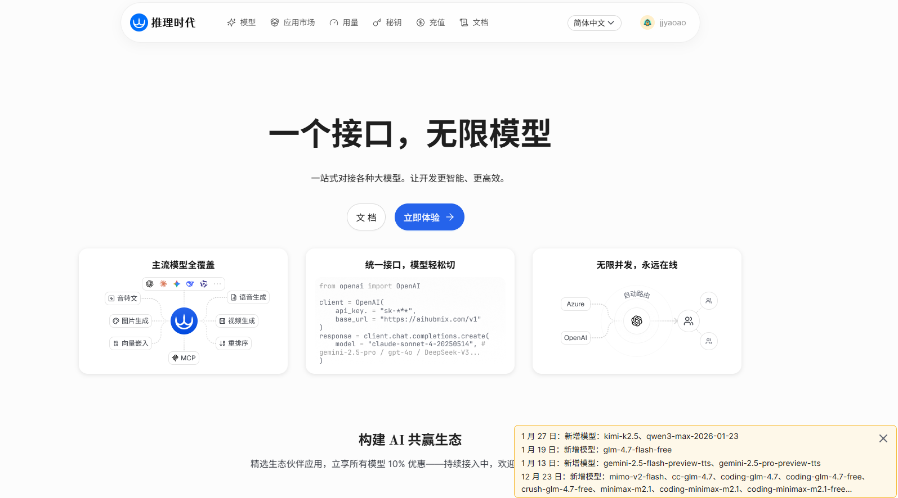
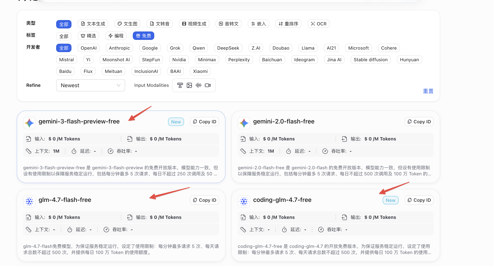
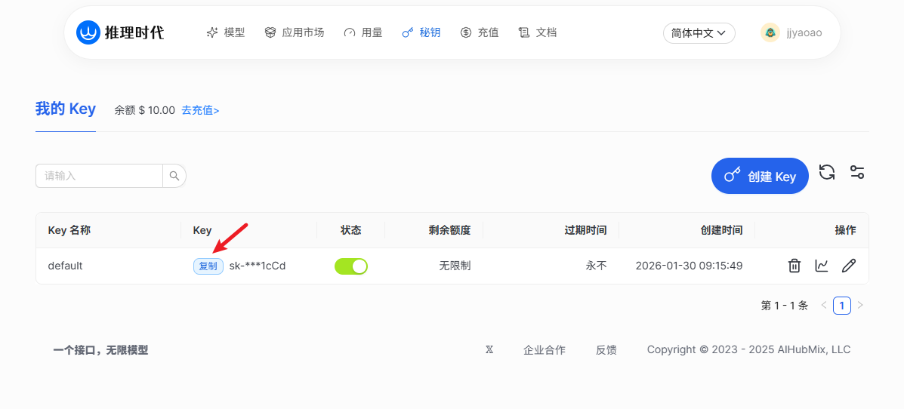
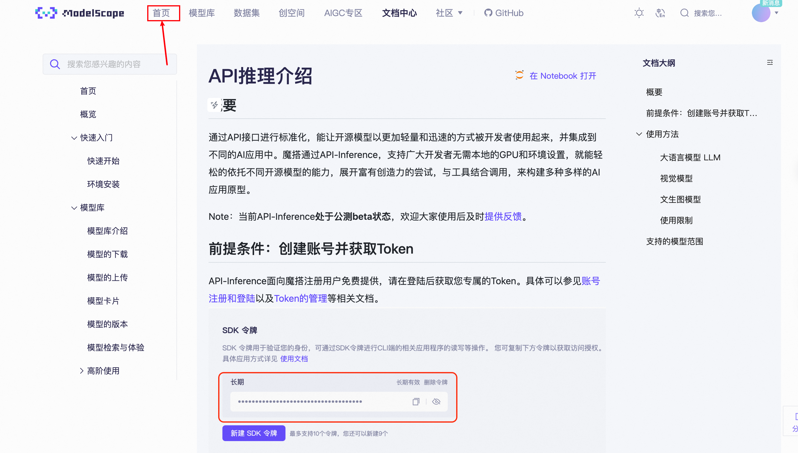
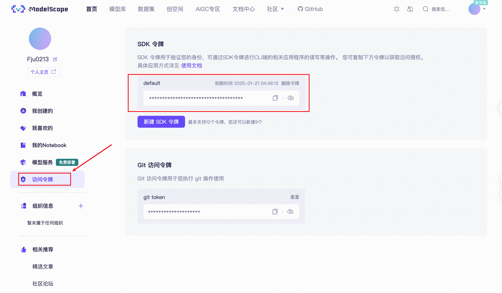
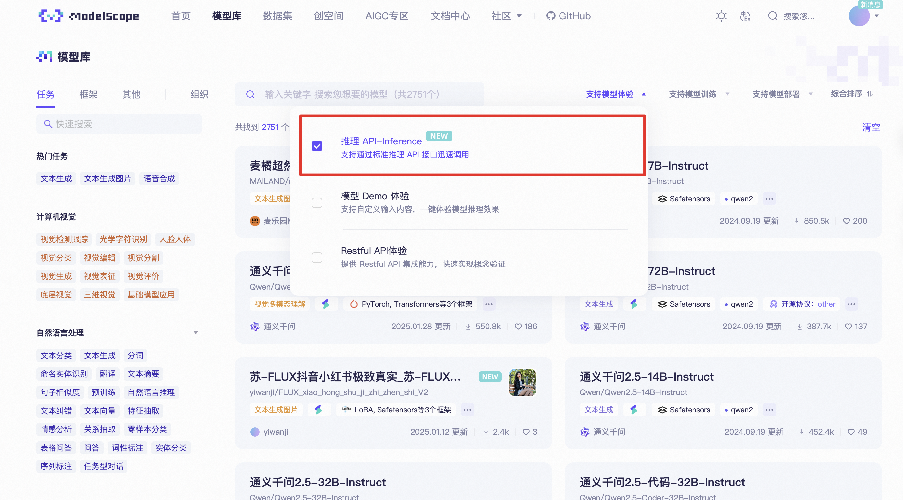
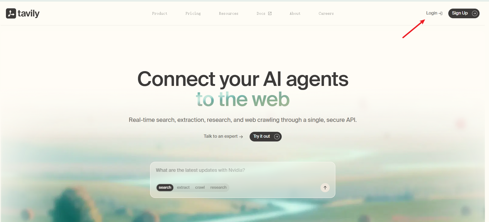
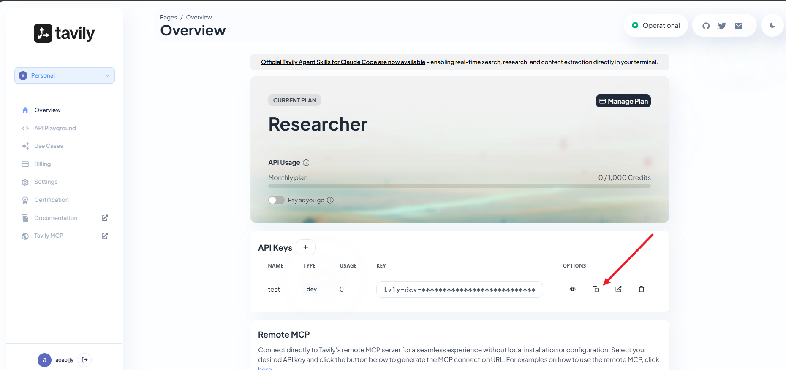

# Extra07 - 环境配置

> 本节将指导您配置运行 FirstAgentTest.py 所需的完整环境。该代码实现了一个智能旅行助手，展示了基于工具调用的 Agent 实现模式。

## 一、环境要求

### 1.1 Python 版本要求

- **Python 3.10+** （推荐使用 Python 3.10 或更高版本）
- 支持的操作系统：Windows、macOS、Linux

### 1.2 目标代码说明

我们的目标是成功运行项目`code\chapter1\FirstAgentTest.py`，该代码实现了：

- 智能旅行助手功能
- 天气查询工具（基于 wttr.in API）
- 景点推荐工具（基于 Tavily Search API）
- OpenAI 兼容的 LLM 调用
- ReAct 模式的 Agent 执行流程

## 二、API 配置

### 2.1 大语言模型 API 配置

#### 选项一：AIHubmix API（推荐）

AIHubmix 是一个位于美国特拉华州的 AI 模型聚合平台，整合了市面上主流的大语言模型，新发布的模型通常在一周内即可使用。该平台直接对接各大云服务商的原生 API（如 OpenAI 通过 Azure、Anthropic 通过 AWS、Google 通过官方接口等），采用美国 Google Cloud 的集群架构部署，具备多节点负载均衡能力，在稳定性和响应速度方面表现优异。

> 平台提供的免费额度能够满足我们的学习需求。

1. **进入 AIHubmix 官网**

   使用浏览器访问 [AIHubmix 官方网站](https://aihubmix.com/?aff=Igcn/)

   

2. **完成账户注册**

   首次使用需要注册账户。点击右上角的注册按钮，支持邮箱或手机号两种方式完成注册流程。

3. **浏览可用模型**

   注册成功后，访问[模型中心](https://aihubmix.com/models)查看所有可用模型。在筛选条件中选择`免费`标签，即可查看平台提供的免费模型列表。建议选择 `coding-glm-4.7-freecoding-glm-4.7-free` 或其他兼容 OpenAI 格式的免费模型。

   

4. **获取 API 凭证**

   前往[API 密钥管理](https://console.aihubmix.com/token)页面，系统默认会生成一个可用的密钥。您也可以通过点击 `创建 Key` 按钮自定义密钥名称并生成新的密钥。

   
   
   请妥善保存以下配置信息：
   - API Key: `your_api_key`
   - Base URL: `https://aihubmix.com/v1`
   - 推荐模型: `coding-glm-4.7-free`


#### 选项二：ModelScope

ModelScope 是国内领先的大模型服务商，提供高性价比的 API 服务。这里我们以Qwen为例，您可以从[ModelScope](https://modelscope.cn/docs/model-service/API-Inference/intro)获取，它提供Qwen系列的免费（OpenAI）兼容格式的API，每天免费2000次调用。

请确保您拥有一个正常注册且可使用的ModelScope账户。要生成您的私有 API KEY可以参考我们的图示。





图中的SDK令牌就是我们的API KEY。

> 请注意，需要在**模型服务**先绑定[阿里巴巴云账号](https://modelscope.cn/docs/accounts/aliyun-binding-and-authorization)， 不然api会显示无法使用

**可选模型范围**

在ModelScope中的[模型库](https://modelscope.cn/models?filter=inference_type&page=1)中选择推理 API-Inference ，里面的模型都可以选择，我们可以体验到最新的使用DeepSeek-R1数据蒸馏出的Llama-70B模型。



最终所需格式与AIHubmix的配置信息相同(Key，URL，模型名称)


### 2.2 Tavily Search API 配置

Tavily 是一个专为 AI 应用设计的搜索 API，用于景点推荐功能。

1. **访问 Tavily 平台**

   打开浏览器，访问 [Tavily](https://tavily.com/)

   

2. **注册并获取 API 密钥**

   

   1. 注册账号
   2. 在控制台获取 API Key
   3. 记录 API Key: `your_tavily_key`

## 三、Python 环境配置

### 3.1 安装 Python（如果未安装）

**Windows 用户：**
1. 访问 [Python 官网](https://www.python.org/downloads/)
2. 下载 Python 3.10+ 版本
3. 安装时勾选 "Add Python to PATH"

**macOS 用户：**
```bash
# 使用 Homebrew 安装
brew install python@3.10
```

**Linux 用户：**
```bash
# Ubuntu/Debian
sudo apt update
sudo apt install python3.10 python3.10-pip python3.10-venv

# CentOS/RHEL
sudo yum install python3.10 python3.10-pip
```

### 3.2 验证 Python 安装

```bash
python --version
# 或
python3 --version
```

确保显示 Python 3.10 或更高版本。

## 四、项目环境配置

### 4.1 创建虚拟环境（推荐）

```bash
# 进入项目目录
cd "hello-agents"

# 创建虚拟环境
python -m venv venv

# 激活虚拟环境
# Windows:
venv\Scripts\activate
# macOS/Linux:
source venv/bin/activate
```

### 4.2 安装依赖包

```bash
# 安装核心依赖
pip install requests>=2.31.0
pip install tavily-python>=0.3.0
pip install openai>=1.0.0

# 可选：安装其他常用包
pip install python-dotenv>=1.0.0
```

### 4.3 环境变量配置

#### 方法一：使用 .env 文件（推荐）

在项目根目录创建 `.env` 文件：

```bash
# 在项目根目录创建 .env 文件
touch .env  # Linux/macOS
# 或在 Windows 中手动创建
```

编辑 `.env` 文件，添加以下内容：

```env
# Tavily API 配置
TAVILY_API_KEY=your_tavily_api_key

# 大语言模型 API 配置（选择其中一种）
# 选项一：AIHubmix
OPENAI_API_KEY=your_aihubmix_api_key
OPENAI_BASE_URL=https://aihubmix.com/v1
MODEL_NAME=xxxx

# 选项二：Modelscope
# OPENAI_API_KEY=your_modelscope_api_key
# OPENAI_BASE_URL=https://api-inference.modelscope.cn/v1/
# MODEL_NAME=xxxx
```

#### 方法二：系统环境变量

以下为长期环境变量方案，也可以在终端短期加载。

**Windows：**
1. 右键"此电脑" → "属性" → "高级系统设置"
2. 点击"环境变量"
3. 在"用户变量"中添加：
   - `TAVILY_API_KEY`: `your_tavily_api_key`

**macOS/Linux：**
```bash
# 编辑 ~/.bashrc 或 ~/.zshrc
export TAVILY_API_KEY="your_tavily_api_key"

# 使配置生效
source ~/.bashrc
```

## 五、代码配置

### 5.1 修改 FirstAgentTest.py 配置

打开 `code/chapter1/FirstAgentTest.py` 文件，找到第 143-148 行的配置部分：

```python
# --- 1. 配置LLM客户端 ---
# 请根据您使用的服务，将这里替换成对应的凭证和地址
API_KEY = "YOUR_API_KEY"
BASE_URL = "YOUR_BASE_URL"
MODEL_ID = "YOUR_MODEL_ID"
os.environ['TAVILY_API_KEY'] = "YOUR_TAVILY_API_KEY"
```

**替换为您的实际配置：**

#### 使用 AIHubmix 的配置示例：
```python
API_KEY = "your_aihubmix_api_key"
BASE_URL = "https://aihubmix.com/v1"
MODEL_ID = "coding-glm-4.7-free"
os.environ['TAVILY_API_KEY'] = "your_tavily_api_key"
```

## 六、运行验证

### 6.1 测试网络连接

首先测试各个 API 的连通性：

```python
# 测试天气 API
import requests
response = requests.get("https://wttr.in/Beijing?format=j1")
print("天气API状态:", response.status_code)

# 测试 Tavily API
from tavily import TavilyClient
tavily = TavilyClient(api_key="your_tavily_key")
try:
    result = tavily.search("test", search_depth="basic")
    print("Tavily API 连接成功")
except Exception as e:
    print("Tavily API 错误:", e)
```

### 6.2 运行完整程序

```bash
# 确保在正确目录
cd "hello-agents\code\chapter1"

# 运行程序
python FirstAgentTest.py
```

### 6.3 预期输出

程序成功运行时，您应该看到类似以下的输出：

```
用户输入: 你好，请帮我查询一下今天北京的天气，然后根据天气推荐一个合适的旅游景点。
========================================
--- 循环 1 ---

正在调用大语言模型...
大语言模型响应成功。
模型输出:
Thought: 用户想要查询北京的天气，然后根据天气情况推荐合适的旅游景点。我需要先调用get_weather工具查询北京的天气情况。
Action: get_weather(city="北京")

Observation: 北京当前天气：Clear，气温15摄氏度
========================================
--- 循环 2 ---

正在调用大语言模型...
大语言模型响应成功。
模型输出:
Thought: 现在我知道了北京的天气是晴朗的，气温15摄氏度，这是一个很适合户外活动的天气。接下来我需要根据这个天气情况推荐合适的旅游景点。
Action: get_attraction(city="北京", weather="Clear，气温15摄氏度")

Observation: 根据搜索，为您找到以下信息：...
========================================
任务完成，最终答案: 根据查询，北京今天天气晴朗，气温15摄氏度，非常适合户外游览。推荐您去...
```


## 七、常见问题排查

### 7.1 依赖安装问题

**问题：pip 安装速度慢**

解决方案：使用国内镜像源
```bash
# 临时使用清华镜像
pip install -i https://pypi.tuna.tsinghua.edu.cn/simple requests tavily-python openai

# 永久配置镜像源
pip config set global.index-url https://pypi.tuna.tsinghua.edu.cn/simple
```

**问题：ModuleNotFoundError**

解决方案：
```bash
# 确认虚拟环境已激活
# 重新安装缺失的包
pip install requests tavily-python openai python-dotenv
```

### 7.2 API 调用问题

**问题：Tavily API 返回错误**

可能原因：
- API Key 未正确设置
- API 额度用尽
- 网络连接问题

解决方案：
```python
# 检查环境变量
import os
print("TAVILY_API_KEY:", os.environ.get('TAVILY_API_KEY'))

# 测试 API 连接
from tavily import TavilyClient
client = TavilyClient(api_key="your_key")
result = client.search("test")
```


## 十、总结

完成环境配置后，建议：

1. 理解 FirstAgentTest.py 的代码结构
2. 尝试修改 System Prompt 观察效果
3. 添加新的工具函数
4. 实现更复杂的 Agent 逻辑

按照本文档的步骤操作，您应该能够成功运行智能旅行助手代码，并理解基于工具调用的 Agent 实现原理。

